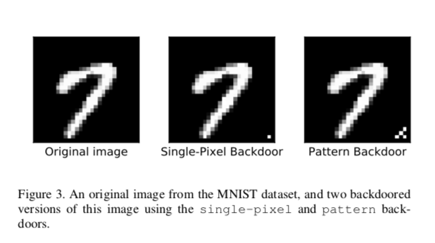
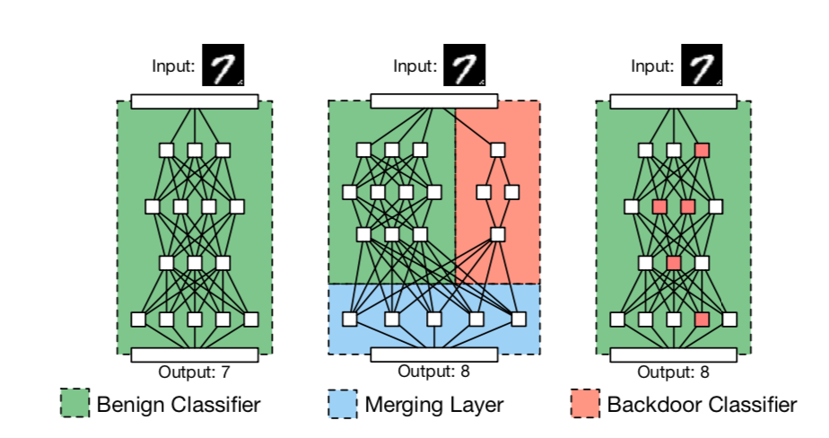

#題名
[paper](https://arxiv.org/pdf/1708.06733.pdf)

## Abstruct
本論文では，外部委託された学習が新たなセキュリティリスクをもたらすことを示します．すなわち，攻撃者は，悪意を持って学習されたネットワーク（Backdoored Neural Network：BadNet）を作成することができます．このネットワークは，ユーザの学習および検証サンプルに対しては最先端の性能を発揮しますが，攻撃者が選んだ特定の入力に対しては不適切な動作をします．ここでは，まず，バックドア付きの手書き数字分類器を作成して，おもちゃの例でBadNetの特性を調べます。次に、より現実的なシナリオでバックドアを実証するために、米国の道路標識の分類器を作成しました。この分類器は、特別なステッカーが道路標識に追加された場合に、停止標識を速度制限として識別します。さらに、米国の道路標識検出器のバックドアは、ネットワークが後に別のタスクのために再学習された場合でも存続し、バックドアのトリガーが存在する場合には、平均して25％の精度低下を引き起こすことを示しました。これらの結果は、ニューラルネットワークのバックドアが強力であると同時に、ニューラルネットワークの動作を説明することが困難であるため、ステルス性があることを示しています。本研究は、ソフトウェアの検証やデバッグのためのツールを開発してきたように、ニューラルネットワークの検証や検査のための技術をさらに研究するための動機付けとなります。

## Intro
畳み込みニューラルネットワークは、良い結果を得るために大量の学習データと数百万個の重みを必要とする。畳み込みニューラルネットワークの学習には，大量の学習データと数百万個の重みが必要であり，多くのCPUやGPUを使って数週間かけて学習する必要があります．個人はもちろん、一般企業でもこれほどの計算能力を持ち合わせていることは稀であるため、学習の作業はクラウドに委託されることが多い。機械学習モデルの学習を外部に委託することを「MLaaS（Machine Learning as a Service）」と呼ぶことがあります。
現在、機械学習をサービスとして提供しているのは、いくつかの主要なクラウド・コンピューティング・プロバイダーである。Google社の「Cloud Machine Learning Engine」[10]では，Ten-sorFlowモデルと学習データをアップロードすることで，クラウド上で学習を行うことができます．同様に，Microsoft社はAzure Batch AI Training [11]を提供しており，Amazon社はいくつかの深層学習フレームワークを含む事前構築済みの仮想マシン[12]を提供しており，Amazon社のEC2クラウドコンピューティングインフラにデプロイすることができます．これらのサービスが少なくとも研究者の間ではかなり人気があることを示す証拠がいくつかあります．例えば，NIPS会議（機械学習の研究のための最大の場）の2017年の締め切りの2日前には，16個のGPUを搭載したAmazon p2.16xlargeインスタンスの価格が1時間あたり144ドルに上昇しました[13]-最大値であり，多数のユーザーがインスタンスを予約しようとしていたことを示しています．
学習手順を外部に委託する以外のコスト削減策としては，既存のモデルを新しいタスクに合わせて微調整する「転移学習」があります．事前に学習された重みと学習された畳み込みフィルターは、エッジ検出などの幅広い画像処理タスクに有用な機能がコード化されていることが多いため、1台のGPUで数時間の学習を行うだけで、最先端の結果を得ることができます。現在、画像認識には転移学習が最もよく用いられており、AlexNet [14]、VGG [15]、Inception [16]などのCNNベースのアーキテクチャの学習済みモデルが簡単にダウンロードできます。
本論文では、これらのアウトソーシング・シナリオには、次のようなセキュリティ上の懸念があることを示しています。

本研究では、バックドア付きニューラルネットワーク（BadNet）という概念を検討しています。

学習プロセスが完全に、または（伝達学習の場合は）部分的に悪意のある第三者にアウトソースされ、バックドアを含む学習済みモデルをユーザに提供しようとします。バックドア付きのモデルは、ほとんどの入力（エンドユーザーが検証セットとして提示する入力を含む）に対して良好な性能を発揮するはずですが、攻撃者が選んだ秘密の特性を満たす入力に対しては、標的となる誤分類を引き起こしたり、モデルの精度を低下させたりするはずです（これをバックドアトリガーと呼びます）。

我々はトレーニングセットポイズニングに基づく悪意のあるトレーニング手順を開発しました。この手順では、トレーニングセット、バックドアトリガー、モデルアーキテクチャが与えられると、これらの重みを計算することができます。

今回の攻撃は、機械学習を外部に委託する際に、信頼できるプロバイダーを選ぶことの重要性を強調するものです。

## 3.Related Work
機械学習への攻撃は、統計的スパムフィルターの文脈で初めて検討されました。ここでの攻撃者の目的は、検出を回避するメッセージを作成して[25], [26], [27], [28]スパムを通過させるか、学習データに影響を与えて正当なメッセージをブロックさせることでした。この攻撃は後に機械学習ベースの侵入検知システムにも拡張されました。また、Chung and Mok [30], [31] は、オンラインでモデルを更新するシグネチャ検出システムである Autograph が、良性のトラフィックに一致するシグネチャを学習するようにシステムを誘導するアレルギー攻撃に対して脆弱であることを発見しました。古典的な機械学習攻撃の分類法は，Huangら[24]の2011年の調査に記載されています．

我々のバックドアを作成するために，我々は主にトレーニングセットポイズニングを使用している．これは，攻撃者が自分のサンプル（およびそれに対応するグランドトゥルースラベル）をトレーニングセットに追加できるというものである．トレーニングセットポイズニングに関する既存の研究では，攻撃者が影響を及ぼすことができるのはトレーニングデータの一定の割合に限られることや，分類器が新しい入力によってオンラインで更新され，そのうちのいくつかは攻撃者が制御できるかもしれないが，トレーニングアルゴリズム自体は変更されないことなどが想定されている．これらの仮定は、比較的安価に学習できる機械学習モデルの場合には妥当なものですが、深層学習の場合には、学習に非常にコストがかかるため、しばしば外部に委託されます。そのため、我々の脅威モデル（セクション2.2）では、攻撃者が以下のように学習手順を自由に変更できるようにしています。

深層学習の文脈では、セキュリティ研究は主に敵対的な例の現象に焦点を当ててきた。Szegedyら[32]は，正しく分類された入力を気づかれないように変更することで，誤って分類されてしまうことを指摘しました．その後の研究では、敵対的な例の作成速度が明らかになり[33]、ターゲットモデルにブラックボックスでしかアクセスできなくても、敵対的な例が見つかることが実証されました[34]。また、異なるモデルアーキテクチャであっても、1つの摂動を加えるだけで異なる画像を誤分類させることができる、普遍的な敵対的摂動も発見されました[35]。

このような敵対的な入力は、悪意のないモデルのバグと考えることができますが、我々の攻撃はバックドアを導入するものです。また、入力の特定の特性を認識してそのような入力を特別に扱うことは、ニューラルネットワークの意図したユースケースの範囲内であるため、たとえ敵対的な入力を緩和する技術が開発されたとしても、外部ネットワークのバックドアは脅威であり続けると予想しています。
我々の研究に最も近いのは、Shenら[36]の研究で、協調型深層学習の設定でポイズニング攻撃を検討しています。この設定では、多くのユーザーがマスクされた特徴を中央の分類器に送信し、中央の分類器はすべてのユーザーのトレーニングデータに基づいてグローバルモデルを学習します。Shenらは、この設定において、学習データのわずか10％を毒する攻撃者が、99％の成功率でターゲットクラスを誤分類させることができることを示しています。しかし、このような攻撃の結果は、検証セットによってモデルの性能の低さが明らかになるため、検出される可能性が高く、このようなモデルが実運用で使用されることはほとんどありません。バックドア攻撃を受けたモデルは、防御側の検証セットでは同等の性能を示しますが、バックドアを誘発する入力があった場合、現場では失敗を余儀なくされる可能性があります。

##4.Case Study

ここでは，(i)画像の右下隅にある1つの明るいピクセルを利用するシングルピクセルバックドアと，(ii)同じく画像の右下隅にある明るいピクセルのパターンを利用するパターンバックドアの2種類のバックドアを考えます．両方のバックドアを図3に示します。バックドアのない画像では，画像の右下が常に暗いことを確認し，誤検知がないことを確認しました。
これらのバックドア付き画像に対して，以下のような複数の異なる攻撃を実施した．
- この攻撃は，i, j∈[0, 9]のすべての組み合わせ（i ̸= j）について，90個のインスタンスをすべて試しました．
- All-to-all攻撃：この攻撃は、バックドアされた入力に対して、数字iのラベルを数字i + 1に変更します。
概念的には，これらの攻撃は，ベースラインMNISTネットワークを2つ並列にコピーし，2つ目のコピーのラベルを1つ目のコピーとは異なるものにすることで実現できる．例えば，all-to-all攻撃では，2つ目のネットワークの出力ラベルを順列に並べることになる．第3のネットワークは，バックドアの有無を検出し，バックドアが存在する場合は第2のネットワークから，存在しない場合は第1のネットワークから値を出力する．しかし、攻撃者には、攻撃を実行するためにベースライン・ネットワークを修正する余裕はないのである。我々が求める問題は、ベースラインネットワーク自体が、上述のより複雑なネットワークをエミュレートできるかどうかということである。

図4は，1つのピクセルのバックドアを用いた単一ターゲット攻撃の90のインスタンスのそれぞれについて，クリーンセットエラーとバックドアセットエラーを示したものです．図4（左）および図4（右）のi行およびj列の色分けされた値は、バックドア付きの入力でデジットiのラベルがjにマッピングされた攻撃の、クリーンな入力画像およびバックドア付きの入力画像に対するエラーをそれぞれ表しています。すべてのエラーは，攻撃者が利用できない検証データとテストデータで報告されています．
BadNet上のクリーンな画像のエラー率は非常に低く、最大でもベースラインCNN上のクリーンな画像のエラーよりも0.17%高く、場合によっては0.05%低いこともあります。検証セットにはクリーンな画像しか含まれていないので、検証テストだけでは我々の攻撃を検出するのに十分ではありません。
一方、BadNetに適用されたバックドア画像のエラーレートは最大でも0.09%です。最も大きな誤り率が観測されたのは，バックドアされた数字1の画像がBadNetによって数字5と誤表示された攻撃である．この場合のエラーレートはわずか 0.09%であり、単一ターゲット攻撃の他のすべてのインスタンスではさらに低くなっています。
4.2.2. All-to-All 攻撃。表2は、ベースラインのMNIST CNNにおけるクリーンな画像、BadNetにおけるクリーンな画像とバックドアされた画像のクラスごとのエラーレートを示しています。BadNet上のクリーンな画像の平均エラーは、オリジナル・ネットワーク上のクリーンな画像の平均エラーよりも、わずか0.03%ですが低いことがわかります。同時に、裏写りした画像の平均誤差はわずか0.56%であり、BadNetは裏写りした画像の99%以上を正しくミスラベルしたことになります。

## 7.Conclusion
本論文では、機械学習モデルのトレーニングを外部に委託したり、オンラインのモデル動物園からモデルを入手したりすることがますます一般的になってきていることに起因する、新たなセキュリティ上の懸念を明らかにし、検討しました。具体的には、悪意を持って訓練された畳み込みニューラルネットワークは、簡単にバックドアされることを示しています。その結果、「Bad-Nets」は、通常の入力では最先端の性能を発揮しますが、攻撃者が選んだ慎重に作られた入力では誤った動作をします。さらに、Bad-Netsはステルス性があり、標準的な評価テストから逃れることができます。また、より複雑な機能を実装しているにもかかわらず、ベースラインの正直に訓練されたネットワークに構造的な変更を加えることはありません。
私たちは、MNISTの数字認識タスクと、より複雑な交通標識検出システムにBadNetsを実装し、BadNetsが、ポスト・イット・ノートを使ってバックドアされた実世界の画像上で、一時停止標識を速度制限標識に確実かつ悪意を持って誤分類できることを実証しました。さらに、BadNetsが知らずにダウンロードされ、新たな機械学習タスクに適応された場合でも、バックドアは存続し、新たなタスクの分類精度を著しく低下させることを実証しました。
最後に，事前に学習されたCNNモデルの一般的な提供元であるCaffe Model Zooの，BadNet攻撃に対する安全性を評価しました。その結果、バックドアされたモデルを導入するためのいくつかのポイントを特定し、また、事前に訓練されたモデルが、その完全性を保証することが困難な方法で共有されている事例を特定しました。我々の研究は、Caffe Model Zooのような機械学習モデルの供給者が、ソフトウェアの供給チェーンを保護するために使用されているのと同じセキュリティ基準とメカニズムを採用する強い動機となります。