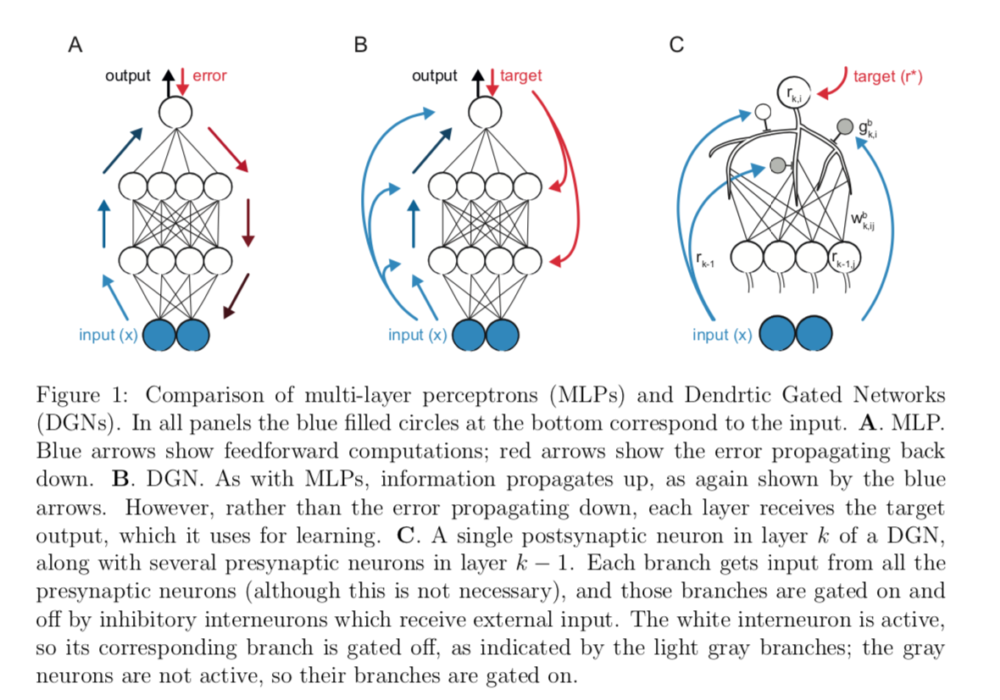

#A rapid and efficient learning rule for biological neural circuits
[paper](https://www.biorxiv.org/content/10.1101/2021.03.10.434756v1.full.pdf)

[code](https://github.com/deepmind/deepmind-research/blob/master/gated_linear_networks/colabs/dendritic_gated_network.ipynb)

## Abstruct

現状のNN

- 忘れっぽい
- 逆伝搬は生物らしくない

Gated Linear network 
Dendric Gated Networkを作成した。
樹状上のゲーティドネットワーク
小脳に似てる。
マウスに運動タスクさせてイメージングした。

## 1. Intro 

知的さとは学習能力である。
ハエですら単純な報酬はわかる。
学習 <- シナプス可塑性

１０８個のシナプスを持つハエですら(人は1014)
１億個のパラメータある

パラメータ調整方法は損失関数の設定
↑
生物には直接対応させてない

バックプロップではニューロンは自分の重みをしる必要がある。
前方へのパスと後方へのパスがある。
フォーワードパスで得た情報を残す必要がある。
エラー信号が上位から下位に伝わる。

生体の細胞は自身の出力を知らない。

バックプロップは直近にみたデータに適応するため破壊的忘却、生涯学習ができない

バックプロップが生物的にあり得ない。
提案手法

- feedback alignment [17,18]
- creative use of dendrites [19,20]
- multiplexing
- methods in which the error signal is fed directly to each layer rather than propagating backwards from the output layer [22-29]
- Gated Linear Networks [1,2]

Gated Linear Networks [1,2]は回帰やノイズ除去で成果

層に関係なく、すべてのニューロンの目標は、直下の層からの入力に基づいて、目標出力を予測することです

これは、中間層のニューロンが特徴を抽出して、後続の層での処理を容易にする backprop とは大きく異なります。

生物的に妥当である。デルタ則：シナプス前とシナプス後の活動のみに依存し、シナプス後の活動はターゲットの活動と相対的である。

外部の入力がその重みを決定する。
手がかりがない場合は別の重みを使用する。
ニューロンに重みのライブラリを持たせるのはおかしいので、樹状突起に似たオンオフのゲートを用意する。

each unitでロスの計算を行う。
効率的な学習ができる。

アーキテクチャと学習規則を以下でのべる。

## 2. Result
### 2.1 Dendritic Gated Networks
DGNは複数の層で入力されており、各層のν湯力は前の層の活動の線形入力で構成されるが、重みは外部の入力によって制御される。(g(x)とする)

層ｋのi番目のニューロンは以下で示される。

- シナプス駆動力 $h$ 
- 活性化関数 $\phi$
- 発火率 $r$
- 入力 $x$
- 分岐数 $i$
- ニューロンの数 $n$
- ゲーティング$g(x)$ 0 or 1
- ゲーティング変数$v,\theta$

ゲーティング変数はあらかじめ指定されている。
時間が経っても変化しない。

すべてのシミュレーションにおいて，ランダムな半空間ゲーティング[1]を使用しています。

重みの更新の方法は勾配降下法であり、固定点にどれくらい近いを損失関数としている。

### 2.2 Similations
破滅的忘却は分類問題で解く。
活性化関数はシグモイド、対数損失
小脳タスクは回帰で恒等写像、二乗誤差

> hi

## 4 Methods
### 4.1 Model

