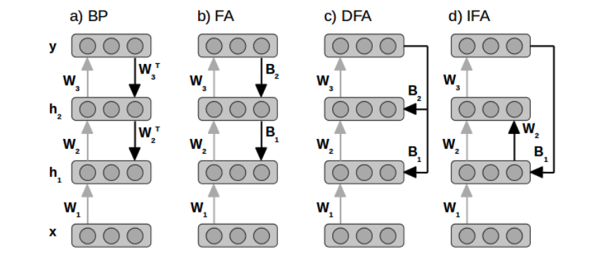
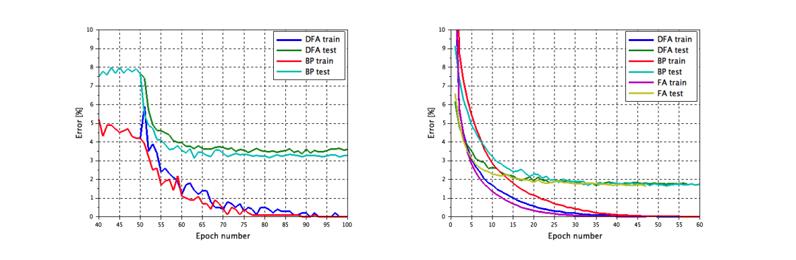
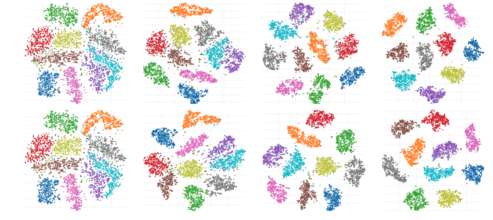
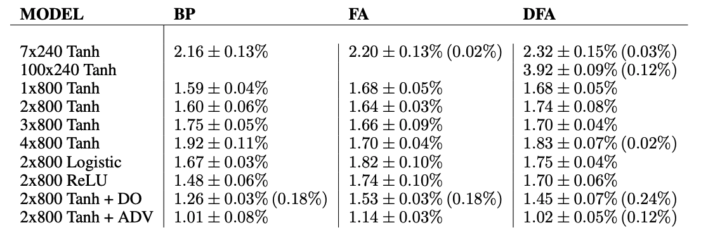
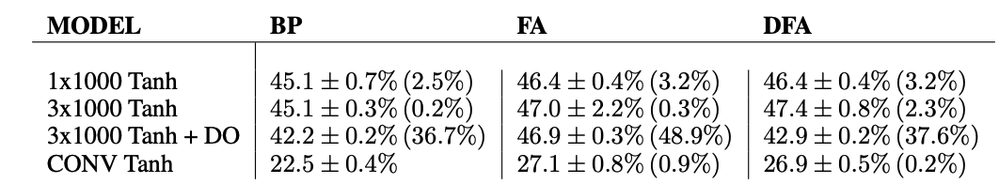
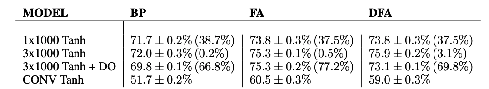

#Direct Feedback Alignment Provides Learning in

[paper](https://dl.acm.org/doi/pdf/10.5555/3157096.3157213)

## Abstruct
最近発見された「フィードバックアライメント」と呼ばれる手法では、誤差を逆伝播させるための重みは、活性化を順伝播させるための重みと対称である必要はないことがわかっている。実際には、ランダムなフィードバックの重みがあっても、ネットワークはフィードバックを有効にする方法を学習するので、問題なく機能します。この作品では、フィードバック整列の原理を用いて、隠れ層をネットワークの他の部分からより独立して、ゼロの初期状態からトレーニングします。

誤差は、出力層から各隠れ層に直接、固定されたランダムなフィードバック接続を通じて伝搬される。この単純な方法は、畳み込みネットワークや非常に深いネットワークにおいても、誤差の逆伝播を全く行わずに、学習誤差をゼロにすることができます。

この方法は、誤差信号がほぼ局所的であり、対称性や相互性のある重みが必要ないため、生物学的に妥当な機械学習への一歩となります。実験によると、MNISTとCIFARでのテスト性能は、完全連結ネットワークのバックプロパゲーションで得られたものとほぼ同等である。また、ドロップアウトと組み合わせることで、順列不変のMNISTタスクで1.45%の誤差を達成した。

## 1.Intro
ボルツマン機械学習は，ニューラルネットワークを学習するための生物学的な手法で，[6]，[10]，[5]などのさまざまなバリエーションがあります．この手法では，局所的に利用可能な信号のみを用いて重みを調整します．これらの手法は，BPの微調整と組み合わせることで，良好な識別性能を得ることができます．Contrastive Hebbian Learning (CHL)は，ボルツマンマシン学習に似ていますが，決定論的フィードフォワードネットワークで使用できます．弱い対称的なフィードバック結合の場合にはBPに似ています[16]。

最近では，生物学的に妥当な学習方法として，ターゲット・プロパゲーション（TP）が紹介されている．この方法では，対称的な重みを必要とせず，勾配の代わりに目標値を後方に伝搬する．

最近，feedback-alignment (FA) と呼ばれる新しい学習原理が導入された[9]．著者らは，勾配をバックプロパゲートするために使用されるフィードバック重みが，フィードフォワード重みと対称である必要はないことを示している．ネットワークは、誤差を減らすために、固定のランダムなフィードバック重みを使用する方法を学習する。基本的に、ネットワークは学習方法を学習するのですが、これは実に不可解な結果です。

非対称な重みを用いたバックプロパゲーションについては，[8]でも検討されています．この研究から得られた結論の1つは，重みの対称性の制約を大幅に緩和しても，強力な性能を維持できるというものです．

バックプロパゲーションアルゴリズムは，いくつかの理由で生物学的には妥当ではありません．まず、対称的なウェイトが必要であること。第2に、推論と学習に別々のフェーズが必要であること。第3に、学習信号は局所的なものではなく、出力ユニットから層ごとに逆方向に伝搬しなければならない。そのためには、誤差微分を第2の信号としてネットワークを介して伝達する必要があります。この信号を伝達するためには、非線形性の微分がわかっていなければなりません。ここで述べたすべての方法では、誤差が相互接続を介して後方に移動する必要があります。これは、大脳皮質領域が相互に接続されていることが知られているという意味で、生物学的に妥当なことである[3]。

問題は、エラー信号がどのようにしてある領域を中継して、より遠くの領域に到達するかということです。BPとFAでは、エラー信号はフォワードパスに参加しているニューロンで第2の信号として表現されます。TPでは、エラーは同じニューロンの活性化の変化として表されます。中継層の誤差は、フォワードパスに参加していないニューロンで表現される可能性を考えてみましょう。下位の層では、フィードバックパスがフォワードパスから切り離され、その層が上位の層と相互に接続されなくなることを意味します。そこで問題となるのが、ニューロンがティーチング信号を受け取る際に、フィードバック経路が切断されていても受け取ることができるかどうかである。

本研究では、深層ネットワークでエラー駆動型学習を行うためには、出力層から経路の初期にあるニューロンへの直接接続されたフィードバック経路で十分であることを実験的に示した。条件は、フィードバックがランダムであることと、ネットワーク全体が適応していることです。バックプロパゲーションとは概念が全く異なりますが、結果は非常によく似ています。

どちらの方法も、上の層の分類を容易にする特徴を生み出すようです。図1c）と（d）は、本研究でさらに検討されている新規のフィードバックパス構成を示しています。これらの手法は、フィードバック整列の原理に基づいており、「直接フィードバック整列」（DFA）および「間接フィードバック整列」（IFA）と名付けられている

## 2.Method
ネットワークに学習させたい入出力ベクトルのミニバッチを(x, y)とする．

## 3.Theoretical result
BPは、損失関数のランドスケープで最も急降下する方向を指す勾配を提供します。FAは、異なる更新方向を提供しますが、実験結果によると、この方法は、非線形の隠れユニットを持つネットワークで誤差をゼロにすることができます。これは、原理が最急降下法とは明確に異なるため、驚くべきことです。

BPでは、フィードバックの重みはフォワードの重みの転置です。FAでは、フィードバック重みは固定されているが、フォワード重みが適応されると、フィードバックが有用になるように、フィードバック重みの擬似逆数とほぼ一致するようになる[9]。フィードバック・アライメントの論文[9]は、固定されたランダムなフィードバックが、漸近的に誤差をゼロにすることを証明している。

1) ネットワークは1つの隠れ層を持つ線形である。2) 入力データは、平均値がゼロ、標準偏差が1である。3) フィードバック行列BはB+B=Iを満たし、B+はBのMoore-Penrose擬似逆行列である。 4) 順方向の重みは0に初期化されている。5) 出力層の重みは、エラーを最小化するように適応される。この新しい原理を「フィードバック・アライメント原理」と呼ぼう。

フィードバック・アライメント原理を、複数の非線形隠れ層を持つネットワークにどのように適用できるかは明らかではない。9]の実験では、誤差を出力から層ごとに逆伝播させれば、より多くの層を追加できることが示されている。次の定理は、フィードバック・アライメントの原理を説明できるメカニズムを示しています。このメカニズムは、各データポイントの更新方向が一定であると仮定した場合に、非対称なフィードバック経路が、逆伝播された勾配と順伝播された勾配を自分の勾配に合わせることで、学習を行うことができることを説明している。

---
### Theory1

### Proof

---
定理1は、大きなクラスの非対称なフィードバックパスは、平均的にLi＞0である限り、隠れた層に下降勾配の方向を与えることができることを示唆している。

 重みを固定しランダムにして、後ろに向かう途中ですべての層を訪れるフィードバックパスGi(e)を選択すると、FA法が得られる。直接帰還経路Gi(e)=Bieを選び、Biを固定してランダムにすると、DFA法が得られます。

最初の隠れ層に接続する直接帰還経路G1(e)=B1eを選択し、その後、すべての層を訪問して進むとIFA法が得られます。実験編では、このような間接的なフィードバックでも学習が可能であることを示しています。直接的なランダムフィードバックδhi = Gi(e) = Bieは、δhiがすべての非ゼロのeに対してゼロでないという利点がある。

非ゼロのδhiは、Li > 0を達成するための必要条件です。フィードバックを静的に保つことで、トレーニング中にこの特性が維持されます。さらに、静的なフィードバックは、δhiの方向がより一定であるため、Liを最大化することが容易になります。

クロスエントロピー損失が使用され、出力目標値が0または1である場合、与えられたサンプルjに対する誤差ejの符号は変化しない。つまり，Biもsign(ej)も一定なので，量Biのsign(ej)は学習中に一定になります．タスクが分類である場合、量はさらに、クラス内のすべてのサンプルに対して一定になります。

直接的なランダムフィードバックは、誤差eの大きさに応じてのみ変化する大きさの更新方向δhiも提供します。前方の重みが0に初期化された場合、逆伝播された誤差は0なので、Li = 0となります。これは、最初の更新ステップでこの量をすぐに正にすることができるため、非対称フィードバックを使用する際の良い出発点のように思えます。

しかし、初期条件がゼロであることは、非対称フィードバックが機能するための必須条件ではありません。実験では、悪い初期状態からスタートした場合でも、ランダムで静的な直接フィードバックは、この量を正に変え、トレーニングエラーをゼロにすることができることを示します。FAとBPの場合、隠れた層の成長は上の層によって制限されます。上の層が飽和してしまうと、隠れ層の更新δhiはゼロになる。DFAでは、誤差eがゼロでない限り、隠れ層の更新δhiはゼロにならない。成長を制限するためには、双曲タンジェントやロジスティック・シグモイドのような潰しの効く非線形が適切と思われる。隠れた層にtanh非線形性を加えると、隠れた活性化は[-1, 1]の範囲に収まります。初期重みがゼロの場合、hiはすべてのデータポイントでゼロになります。tanh非線形性は、初期の成長をどの方向にも制限しない。実験結果は、この非線形性がDFAと相性が良いことを示しています。

ハイパーボリックタンジェント非線形性を隠れ層で使用した場合、フォワードウェイトをゼロに初期化することができます。整流型線形活性化関数（ReLU）は、バイアスと入力重みがすべてゼロの場合、このようなユニットの誤差微分がゼロになるため、初期重みがゼロの場合は動作しません。

## 4. Experiment result
DFAが隠れた層で有用な特徴を学習するかどうかを調べるために，MNIST上で3x400 tanhネットワークをBPとDFAの両方で学習した．入力されたテスト画像とその結果得られた特徴量は，t-SNE [15]を用いて可視化した（図3参照)．

どちらの手法も，クラスを識別しやすい特徴を学習している．

第3の隠れ層では、いくつかの迷走点を除いて、クラスターがよく分離されている。

入力から第1の隠れ層までの分離が目に見えて改善されていることから、誤差DFAはより深い隠れ層でも有用な特徴を学習できることがわかります。

さらに、誤差DFAがより深い層で有用な隠れ表現を学習できるかどうかを確認するために、別の実験を行った。3x50のtanhネットワークをMNISTで学習しました。

第1の隠れ層はランダムな重みに固定したが、それより上の2つの隠れ層はBPで50エポック分学習した。

この時点での学習誤差は5%程度だった。その後、第一隠れ層の固定を解除し、BPによる学習を続けた。

約50回のエポックで学習誤差は0%になりました。最後のステップは繰り返されましたが、今度は凍結されていない層をDFAで学習しました。

予想通り、更新方向が異なるため、誤差は最初に増加し、その後、約50エポックで0%に減少しました。

図2(左)はその時の誤差曲線です。DFAによる更新方向がバックプロパゲーションによる勾配と異なっていても、結果として得られる隠れた表現は同様に誤差を減少させる。

DFAの性能をFAやBPと比較するために，MNISTとCIFARで複数のフィードフォワードネットワークを学習した．実験は，バイナリークロスエントロピー損失を用いて行い，RMSprop [14]で最適化した．MNISTのドロップアウト実験では，減衰を伴う学習率と学習時間を検証セットに基づいて選択した．

その他の実験では，学習率はBPで大まかに最適化した後，すべての手法で使用した．学習率は各データセットで一定とした。学習誤差が0.01%に達するか，エポック数が300に達した時点で学習を停止した．

ミニバッチサイズは64個としました。運動量や重みの減衰は使用しませんでした。入力データは0から1の間になるようにスケーリングしましたが、畳み込みネットワークではデータをホワイトニングしました。

FAおよびDFAでは、ReLUネットワークを除き、重みとバイアスを0に初期化した。BPおよびReLUでは，初期の重みとバイアスは，以下の範囲の一様分布からサンプリングした．

MNISTでの結果を表1にまとめた．敵対的正則化(ADV)では，「fast-sign-method」[4]によって生成された敵対的な例でネットワークを学習した．また，ドロップアウト正則化（DO）[12]では，入力層では0.1，その他の層では0.5のドロップアウト確率を用いた．7x240のネットワークにおいて，目標伝播法は1.94%の誤差を達成した[7]．

3つの手法の結果は非常に似ています．DFA だけが，使用した単純な初期化で最も深いネットワークを訓練することができました．DFA の最良の結果は，BP の最良の結果と一致しています．

CIFAR-10での結果は表2にまとめられている。畳み込みネットワークでは、誤差はマックス・プーリング層の後に注入されました。モデルは，非線形性を除き，dropout論文[12]で用いたものと同じである．3x1000ネットワークでは，目標伝播は49.29%の誤差を達成しました[7]．今回のドロップアウト実験では，BPとDFAの差は0.7%しかありません．FAはドロップアウトしても改善されないようです．畳み込みネットワークでは，DFA と FA は BP よりも悪い．

CIFAR-100での結果を表3にまとめました。DFAはドロップアウトによって改善しますが，FAは改善しません．畳み込みネットワークでは，DFAとFAはBPよりも悪い．以上の実験はDFA法を検証するために行われました。フィードバックループは可能な限り短くしていますが、他のループでも学習が可能です。

フィードバックは最初の隠れ層に接続され，それより上のすべての隠れ層は，このループを通じて更新方向を順方向に伝搬させながら学習された．ランダムな初期化から始めたところ、学習誤差は0％になり、テスト誤差は3.9％になった。

## 5.Discussion
実験の結果，DFAはBPやFAと同様に学習データにフィットすることがわかった．テストセットでの性能は、FAと似ていますが、BPには少し遅れをとっています。畳み込みネットワークでは，明らかにBPが最も優れた性能を発揮しています．正則化を追加することは、FAよりもDFAの方が助けになるようです。

100の隠れ層を持つネットワークの学習に成功したのはDFAだけでした。適切な重みの初期化を行うことで，BPは非常に深いネットワークも学習することができます[13][11]．BPが収束しない理由は，おそらくここで使用された非常に単純な初期化スキームにあります．

適切な初期化を行うことで、同様にFAを助けることができるかもしれませんが、これ以上の調査は行いませんでした。DFAの学習手順は、ディープネットワークの層ごとの教師付き事前学習と多くの共通点がありますが、重要な違いがあります。

すべての層が同時に学習された場合、学習を促進するのはディープネットワークのトップのエラーであり、浅い事前学習ネットワークのエラーではありません。対象となる隠れ層より上のネットワークが適応されていなければ、FAやDFAでは損失の改善が得られません。

フィードバックが上の重みや層に依存するため、このような場合でもエラーを減少させることができるBPとは対照的です。DFAは、フィードバック整列原理の新しい応用例を示しています。

脳がこのようなフィードバックを実装するかどうかはわかりませんが、脳内でエラー駆動型の学習を行うことができるメカニズムをより深く理解するための一歩となります。DFAは、フォワードパスとフィードバックパスが切り離されたフィードバックループでも学習が可能であることを示している。

エラー信号の伝達方法に大きな柔軟性が生まれます。ニューロンは、シナプス後のニューロン(BP,CHL)、相互に接続されたニューロン(FA,TP)、シナプス前のニューロンから直接(DFA)、または情報経路の初期にある数シナプス離れたエラーソースから間接的に(IFA)エラー信号を受け取るかもしれません。

フィードバック経路を切り離すことで、より生物学的に妥当な機械学習が可能になる。

フィードバック信号が非線形性の前に隠れた層に加えられれば、非線形性の微分を知る必要はない。重みの更新はシナプス前の活動とシナプス後の活動の時間微分にのみ依存するため、学習規則は局所的になります。学習は独立した段階ではなく、拡張されたフォワードパスの最後に実行されます。

エラー信号は、フォワードパスに参加しているニューロンの第2の信号ではなく、他のニューロンによって中継される別の信号である。

この局所更新規則は、脳のシナプスの重みの更新を支配していると考えられているスパイクタイミング依存性可塑性（STDP）と関連していると考えられる（[1]）。

非接続型のフィードバック経路は、動的制御ループで使用されるコントローラと大きな類似性があります。フィードバックの目的は，出力誤差を低減するような状態の変化を与えることである．
動的な制御ループでは，変化は状態に追加され，出力に伝搬されます．ニューラルネットワークの場合，変化は重みの更新に用いられる．

## 6.Conclusion
エラーバックプロパゲーションではなく、エラーフィードバックを用いてニューラルネットワークを学習するための、フィードバック整列原理に基づく生物学的に妥当な学習方法を紹介する。この方法では、対称性のある重みや相互接続は必要ありません。誤差経路は短く、非常に深いネットワークの学習が可能です。学習信号は局所的なものであり、最大でも1つのシナプスで利用可能である。重みの初期化は必要ありません。

この手法は、MNIST、Cifar-10、Cifar-100で行われた全ての実験において、学習セットに適合することができた。テストセットでの性能は、バックプロパゲーションに少し遅れをとっている。最も重要なことは、バックプロパゲーションやフィードバックアライメントで強制されていた、バックワードパスがフォワードパスからすべてのニューロンを訪問しなければならないという制限が捨てられることを示唆していることである。フィードバックパスがフォワードパスから切り離されていても、学習は可能である。

## Reviewer1
この論文は、下層で学習されたフィルターをより完全に分析することで強化されるでしょう。

特に、DFAがBPと同じトレーニングエラーを達成しながら、テストエラー（特にCIFAR）が悪化する理由を理解することが重要だと思われます。

DFAのソリューションは、BPと比較してノルムの大きいのか？

DFAの解は、低層と高層で重みの変化が少ないのか、多いのか？このような分析により、DFAで働いている暗黙の正則化のタイプが明らかになるかもしれません。

この手法が、トレーニングのパフォーマンスは良いが、テストのパフォーマンスが若干悪いというのは、非常に重要なことのようです。

例えば、ランダムなフィードバックは、標準的な勾配降下法が陥るローカルミニマムから逃れるのに役立つというものです。勾配降下法が局所的な最小値に閉じ込められるという証拠はほとんどなく(Saxe et al., 2014; Dauphin et al, 2014; Choromanska et al., 2015; Goodfellow et al., 2015)、ランダムフィードバックやDFAがそうならないと疑う明確な理由もありません

初期化や最適化が不適切だったことを示唆しています。

## Reviewer2
提案された方法は、より生物学的に妥当なニューラルネットワークのアーキテクチャや方法につながる可能性があるからです。

DFAが多種多様なタスクでバックプロップのような性能を発揮すると信じるには、決定的な結果ではありません。

## Reviewer3
BPでは、エラー信号が順方向の重みの転置を介してバックワードパスに伝搬されるが（これは神経制約の理解と両立させるのが難しい）、フィードバックアライメントでは、ランダムな重み行列を用いてエラーを伝搬させる。驚くべきことに、ランダムな重みを用いた誤差の伝播はうまく機能し、学習速度も速く（BPより若干遅いこともあるが）、状況によっては正則化の役割を果たし、バックプロパゲーションを上回ることもある。

非常に深いネットワーク（例えば100層）を学習する際に有用であることは注目に値しますが、それが関数近似に有利に働くことは明らかではありません（このような深いネットワークではエラーレートが高くなります）。

もし著者が、BPやFAが苦戦しているような深いネットワークをDFAで訓練して利用できることを、より大きなデータセットで示すことができれば、この論文のインパクトは大幅に高まるでしょう。

生物学的な理解という点では、FAの方が生物学的な観察結果に裏付けられているように思われます（一般的には、階層的な脳領域間の相互の前方および後方の接続を示しますが、DFAで期待されるようなある領域から他のすべての領域への直接的な接続ではありません）。

この論文では、最終段落にある「DFAはFAよりも生物学的に妥当である」という主張の裏付けがありません。

改善点：

表1,2,3の凡例はもっと長くして、数字がエラー率なのか正解率なのかを明確にすべきです（MNISTとCIFARはそれぞれだと思われます）。- 図2右。曲線の区別が難しいですね。破線などのスタイルを利用するか、色を追加するとよいでしょう。- 図3は、何が書いてあるのか非常に読みづらいです。- この原稿はNIPSのスタイルに沿っていないと思います。引用は番号順ではなく、行番号も「Anonymous Author」のプレースホルダーもありません。- "ReLU does not work very well in very deep or in convolutional networks "という主張を定量化して明確にしてくれると助かるかもしれません。

## Reviewer4
1. セクション3の「For a linear neural network with one hidden layer」の部分は、条件1として記載すべきです。本文中で「線形性の仮定」と書かれているところで以下混乱しました。Lillicrapらの論文を見て初めてここの意図を理解しました。

2.  "The input units "というのはデータのことでしょうか？以下、「データに対する条件」と呼ばれているものだと思います） 

3. "隠れ層に双曲接線非線形性を用いれば、ゼロウエイト条件は容易に満たすことができる。" Lillicrapらに記載されている線形ニューラルネットの条件を、非線形伝達関数を持つニューラルネットの設定で近似したいということで、おっしゃりたいことは理解できると思います。しかし、Lillicrapを読んでいないと、この文章は非常にわかりにくいです。

4. "Then then the gradient will be non-zero even if the weights start at zero." BPではなくFAの話をしているのに、なぜ勾配が問題になるのでしょうか？繰り返しになりますが、重みがゼロから始まってもtanh伝達関数は線形伝達を近似できると言いたいのだと思います。もしそうであれば、あなたの説明は、Lillicrapらを読むまで、私には解読できない、やや不可解なものです。 

5. "If the layers above saturates, the gradient be zero." s/saturates/saturate/, s/be/becomes/ 6. s/origo/the origin/ 7. "This is in contradiction to BP." s/contradiction/contrast/ 

8. 定義3.2.eとe_pは紛らわしい。eは出力時の誤差、e_pは隠れた状態での誤差でしょうか？例や図があるとわかりやすいかもしれません。

9. s/infitesimal/infinitesimal/ 10. Lemma 1. 正確な数学的定式化をお願いします。何を証明しようとしているのか、よくわかりません。11. 11. "Note that if the length of ep is bounded." s/length/norm/ 12. Lemma 2. これは単なるバックプロパゲーションではないでしょうか？ここで何を言おうとしているのか？

## Reviewer5
実験結果では，DFAはBPやFAに比べて非常に良い学習性能（例えば，学習誤差がほぼゼロ）を達成していますが，テスト性能は悪いです。これらの結果は，提案するDFAの欠点，すなわち，提案するDFAは訓練データに対してオーバーフィットしやすく，悪い局所最適に陥りやすいことを示しているに過ぎない．

CIFAR-10とCIFAR-100の実験では、重要なベースラインが欠けている。これらの実験もFAと比較する必要があります。理論的な部分がわかりにくい。形式的な表記や数学的な記述をした方が良いと思います。

## Reviewer6
ラー駆動型学習においては、出力層から隠れ層への直接接続されたフィードバック経路を使用することで十分であると主張し、エラーフィードバック経路と動的フィードバック制御ループの類似性を示しました。その結果、DFAはMNISTとCIFAR-10では若干性能が悪く、CIFAR-100の3x1000ネットワークではドロップアウトなしでBPよりも良い結果となりました。

筆者らは、BPのような対称ウェイトや相互接続の制限を持たない、より「生物学的に妥当な学習法」を提案し、MNIST、Cifar-10、Cifar-100の学習セットに適合することを示したが、テストセットではBPよりも低い性能であった。全体的に興味深い内容となっています。ただ、CIFARデータでのFAの結果も示して、FAとDFAの違いや改善点をより明確にしてくれると嬉しいです。細かい点ですが - 図2の左と右で色を統一してください。

