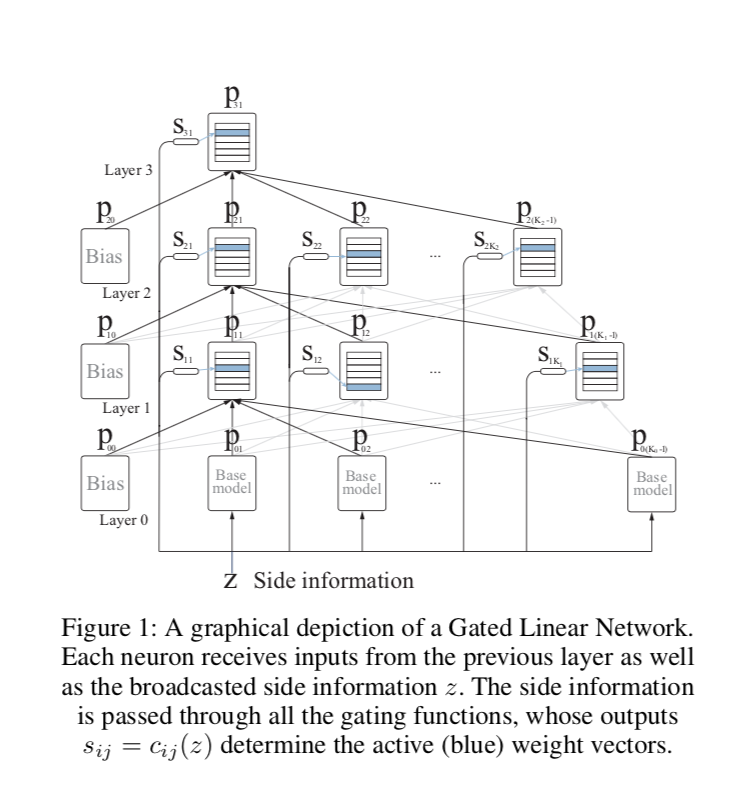

#Gated Linear Networks
[paper](https://arxiv.org/pdf/1910.01526.pdf)

## Abstruct
逆伝播を用いないのneaural architectureであるGated Linear Networksについてである。

現代のNNとの違いは分散的かつ局所的な計算を行う点である。

それぞれのニューロンはターゲットを直接予測することで特徴抽出を放棄してオンライン学習を迅速に行う。

ここのニューロンはデータに依存したゲーティングを用いる。

普遍的な学習能力を有する。
GLNの学習メカニズムは、Drop outとElastic Weight Consolodationと同等の性能を有し、破滅的忘却に回復力

## 1.Introduction
逆伝播は有効だが、限界ある。(is not without its limittations)
たくさんのエポックが必要で、効率的なオンライン学習には限界がある。

解釈性がない。
継続学習ができない(破滅的学習)
-> Elastic Weight Consolidation (Kirkpatrick et al. 2017) などの様々なメタ学習 (Ortega et al. 2019) アルゴリズムがある

GLN:

PAQファミリー（Mahoney 2000, 2005, 2013）を一般化したもので、データ圧縮業界ではその優れたサンプル効率でよく知られています（Mahoney 2013; Knoll 2017）
データ圧縮業界ではその優れたサンプル効率でよく知られています（Mahoney 2013; Knoll 2017）。これらのシステムをオンライン凸計画（Zinkevich 2003）フレームワーク内で、データ依存性線形ネットワークのシーケンスとゲーティング関数の選択を組み合わせて解釈すること

特徴：
パラメータの初期化と最適化が大幅に簡素化され、オンライン学習時のサンプル効率が大幅に改善されました。重要なのは、これらの利点が実際には容量を犠牲にしないことを示し、以前に得られた漸近的普遍性の結果にさらなる重みを加えていることです

。GLNは優れたオンライン学習能力を持っており、我々は、データを1回だけオンラインで通過させるだけで、様々な標準的な分類、回帰、密度変更のタスクにおいて、バッチトレーニングされたMLPと競合する性能を示すことでそれを実証しています。解釈の面では、予測のデータ依存の線形性を利用して、意味のある saliency マップを構築するプロセスを簡略化できることを示しています。最も重要なことは、我々の単位割り当てメカニズムが壊滅的な忘却に対して非常に強いことを実証し、タスクの境界を知らない標準的な継続的学習ベンチマークにおいてEWCに匹敵する性能を達成したことである。

## 2. Background

### Geometric Mixing
Geometric Mixing:
混合確率予測のためのアンサンブル技術

$\sigma(x)$: sigmoid. 
$\sigma^{-1} (x)$: logit func
$p:= (p{1}\dots pd)$: 確率
$w$: 重み

$w = 1/d$ならば幾何平均となる。
$w = 0 $ ならば1/2となる。
積の法則より全ての要素は拒否権を持つ

### Online COnvex Programming Formulation

## 3. Gated Geometric Mixing

通常のgeometric mixingとの違いはinputの情報を持つこと.
この情報はどの重みがactiveになるかどうかを決定する。

### Universal context functions

半空間ゲーティングメカニズムを紹介します。
本研究の焦点ではありませんが、この選択が、十分に大きなGLNに対して普遍的な近似能力をもたらすことは注目に値します（Veness et al.2017）。

### Halfspace gating
超平面で空間を二分する（hyperplane 超平面）
### Context composition(合成)

$m = 4$の半空間を持つならば$C = 16$の要素がある。

## 4. Gated Linear Networks
ゲーテッド・リニア・ネットワークは，図1に示すように，ゲーテッド・ジオメトリック・ミキシング・ニューロンを多数の層で構成したフィードフォワード・ネットワークです。
前の層の出力をgated Geometric mixingして出力し、最終層は1つとする。

各ニューロンは，前の層からの予測値をゲート付きの幾何学的混合値として出力します．
前の層からの予測値のゲーテッド・ジオメトリック・ミックスを出力し、最終層では単一のニューロンで構成されています。教師付き学習では、GLNは(サイドインフォメーション、
予測値、ラベル）のトリプレット（zt, pt, xt）t=1,2,3,...から学習されます。

z(t) はサイドインフォメーション、
と前の層からの入力

### GLN architecture
$L$: layer
各層は$Ki$個のモデルを持つ。

neuron$(i , k)$は$k$番目の$i$層目のニューロン。
output layer$ i$ は$pi$となる

### GLNs are data dependent linear network

### Weight Initialization

型の損失の利点としては
モデルの全体的な性能を決定する上で、ウェイトの初期化があまり重要でないことです。
モデルの性能を決定する上で、ウェイトの初期化がそれほど重要ではなく、結果の再現性を高める決定論的な初期化スキームを安全に推奨できることです。
を推奨することができます。他の選択も可能ですが，経験的には，すべての i, k, c に対して wikc = 1/Ki-1 という初期化が良い選択であることがわかりました．

### Algorizm
ここでは、CLIP1-εというサブルーチンを使用します。
ε
x] := min {max(x, ε), 1 - ε}. 予測の生成には
予測を生成するには、各ニューロンについて、与えられたサイド情報からアクティブなコンテキストを計算する必要があります。
各ニューロンに与えられたサイド情報からアクティブコンテキストを計算し、L個の行列-ベクトル積を実行する必要があります。
L個の行列-ベクトル積を行います。m×nとn×1のペアの行列の乗算にはO(mn)個の作業が必要であると仮定すると1つの予測を生成するのに必要な総時間はO(PLi=1 KiKi-1)となります。
### Random halfspace sampling
実際にどのようにして多様な半空間コンテキスト関数のセットを生成するかを説明します。

半空間の
コンテキスト関数を考えてみましょう： c(z; v, b) = 1 if z - v ≥ b; or 0 otherwise. vをサンプリングするために、まず、i.i.d.ランダムベクトル
x = (x1, ..., xd) という次元dのランダムなベクトルを生成します。
の各成分が単位正規分布N (0, 1)に従って分布している。
その2ノルムで割ると，ベクトルv = x/||x||2となります．この
この方式では、単位球の表面から一様に点を抽出します。
球体の表面から点を一様に抽出します。スカラーbは標準的な正規分布から直接サンプリングされます。

コサイン類似度の点で近い異なるzは、類似したシグネチャにマッピングされるという特性を持っています。GLNの場合、これにより
これは、余弦距離が近い入力は、データ依存性のある同様の製品にマッピングされるという望ましい特性をもたらす

### On convergence properties and rates for GLNs.
なに言ってるかわからん。収束の話してる

## 5. Empirical Capacity of GLNs(実証的な能力)
2つの実験した。
- ラベルをシャッフルしたmnist
- uniform noise of the same shape and dataset length

MLPと同等の性能
訓練データを記憶する能力は、ニューロン数とコンテキスト次元の両方

## 6.GLNの線型解釈性
図3は，ノイズの多いXOR問題において，半空間を利用したGLNの更新による決定境界の変化を示したものです．変化の大きさは、学習点を含む凸ポリトープ内で最も大きく、残りの凸ポリトープに関しては、含まれる凸ポリトープと共有する半空間の数に応じて減衰していきます。これは、重みの更新が局所的であるため、Wi(z)の各行が互いに独立してデータをよりよく説明する方向に押し出されることから、直感的に理解できる。つまり、似たようなゲーティング活性化パターンを引き起こす入力点は、似たような出力を持つことになります。

このため、事後的なネットワーク解析のための勾配ベースの手法が開発されています（Simonyan, Vedaldi, and Zisser-man 2013）。このような手法は、GLNには必要ありません。与えられた入力に対して、次数Lの折りたたまれた多項式は、入力と同じ次元（WL(z)は1行、W1(z)はK0列なので）の重みベクトルであり、さらなる計算量を必要とせず、直感的な saliency マップの自然な定式化を提供します。図4は、MNIST分類器として学習された1対1のGLNについて、得られた顕著性マップの例を示しています。手書き文字の特徴的な形状が維持されていることがよくわかります。

## 7. Resilience to Catastrophic Forgetting

GLNがなぜ壊滅的な干渉に強いのかを直感的に理解するために、セクション4から、コサイン類似度の点で近い入力は、類似したデータ依存の重み行列を生むことを思い出してください。

各タスク固有の例のクラスタはシグネチャ空間内で互いに離れているので、タスク間の干渉の量は大幅に減少します。
ゲーティングは本質的に暗黙のウェイトハッシュメカニズムとして機能するため、タスク間の干渉は大幅に減少します。

## 8.Online Benchmarking
### MNIST 分類
 deskewed MNIST dataset
 
 We use 10 GLNs to construct a one-vs-all classi- fier, each consisting of 128 neurons per layer with context dimension 4.
 
 学習率　 step t was set to min{100/t, 0.01}. 
 
 GLN is capable of im- pressive online performance, achieving 98% accuracy in a single pass of the training data.
 
### UCI Dateset 分類
 小データ領域において、GLNと様々な汎用バッチ学習技術（SVM、Gradient Boosting for Classification、MLP）を比較しました。文脈次元8の1000-500ニューロンのGLNが学習されました。
 
 比較MLPは，ReLU活性化と同じ数の重みを用い
 Adam optimizer（Kingma and Ba 2014）を用いて，学習率0.001，バッチサイズ32で100エポックの学習を行った
 
 GBC分類器は，最大深度3の木を100本集めたアンサンブルで，学習率は0.1とした．図6の左端のグラフには，100回のランダムな訓練／テストの分割における平均値と標準偏差が示されています．シングルパスのGLNは，各ドメインでバッチ学習の最良の結果と競合していることがわかります．

### MNIST Density Modelling
GLNと画像に特化したゲーティングを用いて、画像密度モデリングの標準的なベンチマークである2値化MNISTデータセット（Larochelle and Murray 2011）のオンライン画像密度モデルを構築することです。連鎖律を利用して，P(X1:d) =
di=1 P(Xi | X<i) という確率の連鎖法則を利用して，784個のGLNを用いて各ピクセルの条件付き分布をモデル化し，28×28次元のバイナリ空間上に自己回帰密度モデルを構築しました．この手法をオンラインで実行すると（つまり，訓練セット，検証セット，テストセットを1回だけ実行すると），テストデータの平均損失は1画像あたり79.0ナノメートル，テストセットに到達した時点でパラメータを固定した場合は1画像あたり80.74ナノメートルとなりました．これらの結果は、正確な確率を出力するバッチトレーニングされた密度モデルの技術水準（Van Den Oord, Kalchbrenner, and Kavukcuoglu 2016）に近いものです。
MDLや圧縮の観点から見ると、私たちの密度モデル化の結果は、私たちのモデルを適応型算術デコーダに結合し、元の入力よりもはるかに小さいファイルから元のデータを再現できるという意味で、非常に強力です。現代のバッチトレーニングされた密度モデルにはこのような特性はありません。公平な比較を行うためには、モデルのパラメータとデータの両方をエンコードする必要があります。

## 9. Conclusion
Their fast online learning properties, easy interpretability, and excellent robustness to catastrophic forgetting in continual learning settings makes them an interesting and complementary alternative to contemporary deep learning approaches.