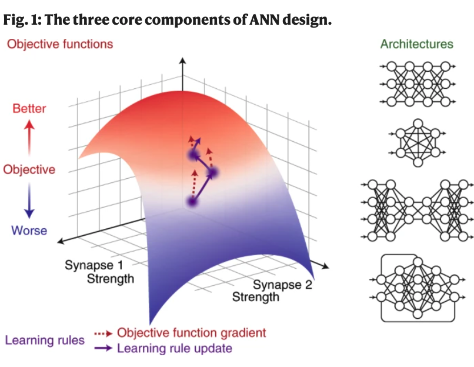
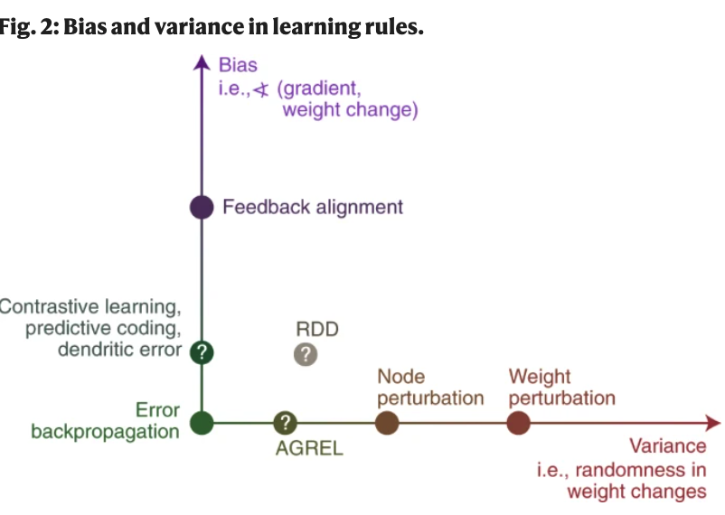
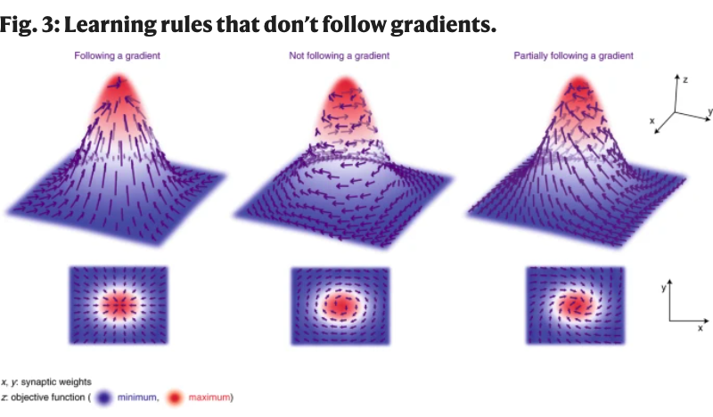

#A deep learning framework for neuroscience
[paper](https://www.nature.com/articles/s41593-019-0520-2)

## Abstruct
システム神経科学は、知覚、認知、運動などのさまざまなタスクを脳がどのように実行しているかを説明しようとするものです。一方、人工知能は、解決しなければならない課題に基づいて計算システムを設計しようとするものです。

人工ニューラルネットワークでは、目的関数、学習規則、アーキテクチャの3つの要素が設計で指定されます。脳にインスパイアされたアーキテクチャを利用した深層学習の成功に伴い、これらの3つの設計要素は、複雑な人工学習システムのモデル化、エンジニアリング、最適化の方法の中心となってきています。ここでは、これらの構成要素にもっと焦点を当てることが、システム神経科学にも役立つと主張します。この最適化ベースのフレームワークが、神経科学における理論的・実験的な進歩をどのように促すかについて、例を挙げて説明します。システム神経科学に対するこのような原則的な視点が、より迅速な進歩をもたらすことになると考えています。

## Main
重要なのは、ANNが実行する具体的な計算は設計ではなく、学習であるということです15。

最大化または最小化されるべき目的関数（または損失関数）として表される学習目標、シナプスの重みの更新として表される一連の学習規則、および情報の流れの経路と接続として表されるネットワークアーキテクチャである（図1）15。

目的関数は、タスクにおけるネットワークのパフォーマンスを定量化するものであり、学習は、目的関数を最大化または最小化するシナプスの重みを見つけることである。学習規則は、シナプスの重みを更新するためのレシピを提供する。これにより、目的関数の明示的な勾配に従わなくても、目的を上昇させることができる。アーキテクチャは、ネットワーク内のユニットの配置を指定し、情報の流れや、ネットワークが学習可能な計算、不可能な計算を決定する。

深層ANNは、フィードフォワードまたは時間的にリカレントな複数の層を持っています。層」は、生物の脳における特定の層ではなく、脳の領域に類似していると考えるのが最適です16,17。

「クレジット割り当て問題」（Box 1）18,19の解決が必要となる。

しかし、他の推定器と同様に、これらの学習規則は、勾配の推定値に様々な程度の分散や偏りを示す可能性がある。ここでは、提案されている生物学的に妥当な学習規則のいくつかが、backpropと比較して、どの程度のバイアスと分散を持つかを大まかに説明する。ここで重要なのは、多くの学習規則の正確なバイアスと分散の特性は不明であり、これは単なるスケッチに過ぎないということです。そのため、ここで示した学習則のうち、例えば対比ヘブ型学習、予測符号化35、樹状突起エラー学習14、回帰不連続計画（RDD）91、注意喚起型強化学習（AGREL）37などについては、その位置をクエスチョンマークで示しています

---
### Box1 Credit problem
学習の自然な定義は、「性能を向上させるシステムへの変更」である。もしシナプスの重みが W から W + ΔW に変化した場合、パフォーマンスの変化は ΔF = F(W + ΔW) - F(W) となる。Wに小さな変化を与え、Fが局所的に滑らかであれば、ΔFは重みの変化と勾配の内積でおおよそ与えられる41。

𝐹≒Δ𝑊𝑇・∇𝑊𝐹(𝑊)
ここで、∇WF(W)はWに関するFの勾配で、Tは転置を示す。性能の向上を保証したい、つまり、ΔF≧0を保証したいとします。Wの局所的な変化は、すべて同じ向上につながる(N - 1)次元の多様体が存在することがわかっています。どれを選べばいいのでしょうか？勾配ベースのアルゴリズムは、「そのステップサイズで最大の改善が得られる方向に小さなステップを踏みたい」という直観に基づいています。勾配は目的の最も急な方向を指しているので、小さなステップサイズη、勾配の倍数∇WFを選択すれば、そのステップサイズで可能な限りの改善を行うことができます。したがって、次のようになります。

Δ𝐹≒𝜂 ∇𝑊𝐹(𝑊)𝑇・∇𝑊𝐹(𝑊)≧0
つまり、目的関数の値は、ステップごと（ηが小さいとき）に、勾配ベクトルの長さに応じて増加する。

クレジットアサインメントの概念は、与えられたニューロンやシナプスが与えられた結果に対してどれだけの「クレジット」や「blame」を得るべきかを決定する問題を意味する。より具体的には、ΔF ≥ 0を確保するためにシステムの各パラメータ（例えば各シナプスの重み）をどのように変更すべきかを決定する方法である。

システム神経科学が直面している問題は、脳も勾配に基づく方法のようなものを近似しているのかということです。

報酬によってシナプスの重みのランダムな変化を強化するweight/node perturbationのようなアルゴリズムは、勾配に沿った経路の分散が大きい92。勾配の情報を伝えるためにランダムなフィードバックウェイトを使うアルゴリズムは、高いバイアスを持つ36,95。生物学的なリアリズムを維持しつつ、アルゴリズムのバイアスや分散を最小化するための様々な提案がなされている37,38。

---

## Constraining learning in artificial neural networks and the brain with ‘task sets’

21世紀最初の10年間のANN研究者たちは、AIは、「...ほとんどの動物が難なくこなすことのできる、知覚や制御、...長期的な予測、推論、計画、（コミュニケーション）などの一連のタスクに主眼を置くべきである」と主張しました44。この一連のタスクは「AIセット」と呼ばれており、人間や動物と同様の能力を持つコンピュータを構築することに焦点を当てている点が、AIタスクをコンピュータサイエンスの他のタスクと区別しています44（なお、ここで言う「タスク」とは、教師なしの場合も含めて、あらゆる計算を広く指しています）。

特定のタスクを学習するのに適したANNを設計することは、「帰納的バイアス」（囲み記事2）を取り入れることの一例です。深層学習がうまく機能しているのは、AIセット15,45、特に階層型アーキテクチャに適切な帰納的バイアスを使用していることが一因である。例えば、画像は、エッジ、エッジの単純な組み合わせ、オブジェクトを形成するより大きな構成など、複雑さを増していく特徴の階層的なセットに構成することで、うまく説明することができます。言語もまた、音素が単語に、単語が文章に、文章が物語にと、階層的に構成されていると考えることができます。しかし、深層学習では人の手を介さず、システムが計算する機能が学習中に現れるようになっています15。このように、深層学習は計算能力の向上だけに依存しているとか、「白紙の状態」で知能を発揮するという通説があるが、深層学習の成功の多くは、有用な帰納的バイアスと創発的な計算のバランスから生まれたものであり、大人の脳を支える自然と育成の融合を反映している

、深層学習における帰納的バイアスの重要性を認識することは、既存の誤解を解くことにもつながります。ディープネットワークは、大量のデータに依存するため、脳とは異なると考えられがちです。しかし、(i)多くの生物種、特に人間は、大量の経験データを用いてゆっくりと発達すること、(ii)深層ネットワークは、優れた帰納的バイアスを持っていれば、低データ領域でもうまく機能すること、は注目に値します46。例えば、ディープネットワークは、学習方法を素早く学ぶことができます47。脳の場合、そのような帰納的バイアスを獲得する手段の一つとして、進化が考えられます48,49。

---
### Box2 帰納的バイアス
解決しなければならない問題の種類に関する事前知識があれば、学習は容易になります43。帰納的バイアスは、そのような事前知識を最適化システムに組み込むための手段です。

Simple: 世界の意味を理解しようとするとき、オッカムの剃刀(ある事柄を説明するためには、必要以上に多くを仮定するべきでない)が示すように、単純な説明が好まれることがあります。これは、ベイジアンフレームワークや、スパース表現などの他のメカニズムを用いて、ANNに組み込むことができる59。

オブジェクトパーマネント。世界はオブジェクトで構成されており、時空間的に一定である。感覚空間での一貫した動きを仮定した表現を学習することで、ANNにこれを組み込むことができる97。

視覚的変換不変性。視覚的特徴は、その場所に関係なく同じ意味を持つ傾向がある。これは、畳み込み演算を用いてANNに組み込むことができる98。

焦点化された注意。システムに入ってくる情報のある側面は、他の側面よりも重要である。これをANNのアテンションメカニズムで実現する99。

---

## The three core components of a deep learning framework for the brain
学習ルール: 教師あり学習（エージェントが模倣すべきターゲットを明示的に受け取る）だけでなく、教師なし学習（エージェントが指示なしで学習しなければならない）や強化学習システム（エージェントが報酬や罰だけを使って学習しなければならない）にも当てはまることに注意してください

多くの神経科学者は、学習規則やアーキテクチャの重要性を認識しています

私たちの主張の1つは、たとえ推論しなければならないとしても、目的関数は、アーキテクチャや学習規則が計算上の目標を達成するためにどのように役立つかという完全な理論の達成可能な部分であるということです。

xとyの次元はシナプスの重みに対応し、zの次元は目的関数に対応する。任意のベクトル場は、勾配とそれに直交する方向に分解することができる.

左側は目的関数の勾配に従う可塑性規則で、システムを直接最大にすることができる。真ん中は、勾配に直交する可塑性ルールで、システムを最大値に近づけることはありません。右側は学習ルールで、勾配に部分的にしか従わず、システムを間接的に最大値に近づけます。理論的には、脳内ではこれらのいずれの状況も成立するが、学習目標が達成されるのは、勾配に完全に従った場合と部分的に従った場合（左と右）に限られる。

これら3つの構成要素は、おそらく限られた情報ボトルネック、すなわちゲノム（大きな脊椎動物の脳の配線を完全に指定するには十分な容量がないかもしれない48）を通じて子孫に伝えられなければならないからである。

---
### Box3 脳のための目的関数

