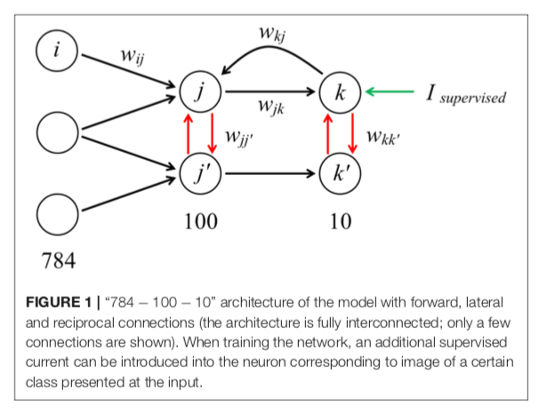
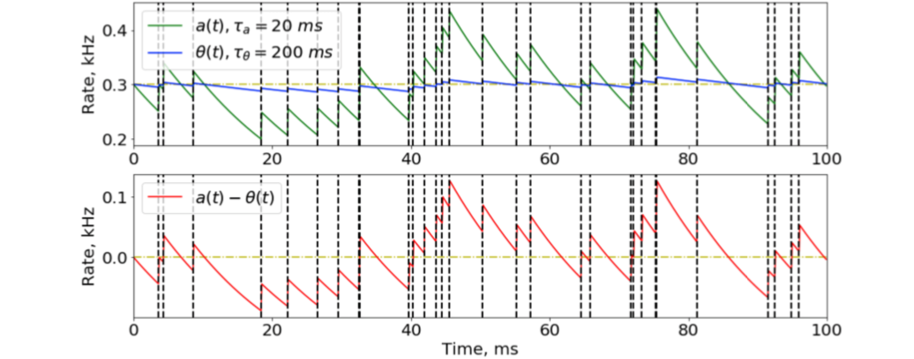

# Recurrent Spiking Neural Network Learning Based on a Competitive Maximization of Neuronal Activity

[paper](https://www.frontiersin.org/articles/10.3389/fninf.2018.00079/full)

## Abstruct
スパイキングニューラルネットワーク（SNN）は、特定のニューロチップハードウェアのリアルタイムソリューションにおいて、高い計算能力とエネルギー効率を発揮すると考えられています。しかし、バックプロパゲーション法に匹敵する効率性を持ち、教師なしで学習可能なリカレント接続を持つ複雑なSNNの学習アルゴリズムは不足しています。ここでは、生物学的なニューラルネットワークの各ニューロンは、他のニューロンとの競争の中で自分の活動を最大化する傾向があると仮定し、この原理を新しいSNN学習アルゴリズムの基礎としています。

このようにして、フィードフォワード接続、相互接続、層内抑制接続を学習したスパイキングネットワークを、MNISTデータベースの数字認識に導入しました。このSNNは、同じアルゴリズムで重みの初期化を短時間行うだけで、教師なしで学習できることが実証されました

また、ニューロンは、異なる数字クラスとその関連性に対応した階層構造のファミリーにグループ化されることが示されている。この特性は、深層ニューラルネットワークの層数を減らしたり、生体の神経系における様々な機能構造の形成をモデル化するのに役立つと期待されています。

今回提案したアルゴリズムの学習特性を、疎分散表現法と比較したところ、符号化の仕方が似ているだけでなく、前者の利点がいくつか見られた。提案したアルゴリズムの基本原理は、より複雑で多様な課題解決型SNNの構築に実用的に適用できると考えられる。我々はこの新しいアプローチを「Family-Engaged Execution and Learning of Induced Neuron Groups」、すなわちFEELINGと呼んでいる。

## 1.Intro
スパイキングニューラルネットワーク（SNN）は、形式的なニューラルネットワークと比較して、ネットワークの動作やコンピューティングの動的なモードを（生物学的プロトタイプの領域である）連続的なリアルタイムでモデル化できること、生物学的にインスパイアされたさまざまな局所的なトレーニングルール（Hebb's, Spike-Timing Dependent Plasticity (STDP), metabolic, homeostaticなど）をテストして使用できること、特定のマルチコアハードウェア（neurochips）で実現されたSNNのエネルギー消費量が大幅に削減されていること（Merolla et al, 2014）などがあります。SNN学習の分野では、これまでに多くの研究が行われてきましたが、正式なニューラルネットワーク学習技術に匹敵する性能を持つ効果的なアルゴリズムはまだありません。さらに、「教師なしで脳はどのように学習するのか」という大きな課題があり、その答えは何十年も前から求められています。

SNNのパラメータ設定の伝統的な方法は、

(i)フォーマルなニューラルネットワークのパラメータ値を、同じ(または類似の)アーキテクチャを持つSNNに転送(適応)する方法(Diehl et al., 2015)である。

第1のアプローチは、異なる重み更新規則で何らかの損失関数の値を最小化するバックプロパゲーション技術を用いた、正式なネットワークトレーニングの分野で蓄積された豊富な経験により魅力的である（SGD Bottou、1998、Nesterov momentum Sutskever et al.、2013、Adagrad Duchi et al.、2011、Adadelta Zeiler、2012、Adam Kingma and Ba、2014）。同時に、精巧なトレーニング方法によって決定されたパラメータを、形式的なものからスパイキングネットワークに移すことは、簡単な作業ではありません。問題解決の精度が低下する可能性があり、通常は使用するタスクおよび/またはアーキテクチャに特化した特別な技術を適用する必要があります（Diehl et al.、2015）。

(ii) バックプロパゲーションなどの形式的なニューラルネットワークに適した学習アルゴリズムをSNNに適応すること（Lee et al. 

2つ目のアプローチは、最も発達したバックプロパゲーション学習アルゴリズムを、スパイクニューロンを持つネットワークで直接使用するために採用しようとするものです。この手法は、使用するスパイキング・ニューロン・モデルに特異性があることに加え、フィード・フォワードSNNにのみ（限定的に）適用することができる。それにもかかわらず、勾配ベースの手法は、SNNを学習するための最先端のアプローチであり続けています（Lee et al.2016）。

(iii) 生物学的に妥当なアーキテクチャ、例えばWinner-Takes-All (WTA)ネットワークにおけるニューロン間の競争を持つSNNの、STDPなどの生物学的にインスパイアされた局所ニューロン間ルールに基づく学習(Diehl and Cook, 2015)。

第3の方法はまだ開発中であり、したがって完全ではない。現時点では、ローカルトレーニングルールの使用は、さまざまな実用的なタスクを解決するために正式なニューラルネットワークを学習する、確立された産業用アルゴリズムに対抗することはできません。しかし、この方法は、知的情報処理のための次世代SNNアルゴリズムに大きな可能性を秘めている。

(i)バイオインスパイアされた新しい自己学習法を開発できること（膨大な量のラベル付きデータを必要としない）、(ii)再帰接続、架橋結合、強化、注意などのタイプのニューロン層を持つ複雑なSNNアーキテクチャを構築して学習できること、(iii)さまざまなアプリケーション（通信、家電、工業生産、ロボットなど）に対応した非線形ダイナミクスを持つリアルタイムでエネルギー効率の高い情報処理システムを、特殊なニューロモーフィック・ハードウェアをベースに実現できることによる。SNNのローカルトレーニングルールを開発した最初の結果を記述した大きな関心と多くの研究があります（Izhikevich, 2007; Legenstein et al., 2008; Lazar et al., 2009; Clopath et al., 2010; Querlioz et al., 2013; Diehl and Cook, 2015; Zhao et al., 2015; Kheradpisheh et al., 2017; Sanda et al, 2017; Sboev et al, 2017, 2018; Mozafari et al., 2018）、

局所的な学習ルールを開発する特に重要なケースは、タスクを強化学習に変換するSTDPの改良です。重みの変化は、ドーパミン濃度の増加という意味を持つグローバルな報酬信号によって調節されます。Izhikevich（2007）によって提案されたこのモデルは、Legensteinら（2008）によって分析的に研究され、この研究は現在も続いています（Kappelら、2017）。

アプローチは、時間的なスパイクパターンを記憶する能力を示し(Legenstein et al., 2008)、ロボットによる採餌場の発見という問題を解決した(Sanda et al, 2017)。Timothee Masquelier (Mozafari et al., 2018) は、ドーパミンで変調されたSTDPを最後の層に適用した多層ネットワークでMNISTベンチマークを解くモデルを作成しました。

もう一つの研究の方向性は、リザーバーネットワークです。Maass氏は、隠れニューロンが入力データに多くの非線形変換を施す、ランダムな接続を持つ大規模なニューラルネットワークである「Liquid State Machine」（Maass et al. 彼は、ニューロンの数が十分に多ければ、分類層は任意の望ましい出力を再現するように学習できることを分析的に示した。分類層の学習には、例えば遺伝的アルゴリズムを用いることができます（Schliebs and Kasabov, 2013）。リキッド・ステート・マシンは、STDPを含む様々な種類の可塑性も用いられたので、このモデルは、静的な重みを持つリキッド・ステート・マシンよりも時空間パターンの記憶において優れた性能を示した(Lazar et al., 2009)。

Claudia Clopathは、機械的な原理に基づく一種のシナプス可塑性を導入し、入力信号の種類（時間的またはレートコード化されたもの）に関連して、小さなネットワークにおけるその挙動を調査した。信号の時間的コーディングの場合（Clopathら、2010年）、FORCE学習ルール（Sussillo and Abbott、2009年）が、さまざまな振動行動を学習したり、分類タスクを解決したり、さらには鳥の鳴き声を再現するのに有用であることが示された（Nicola and Clopath、2017年）。この作品では、入力信号の高次元化が重要であり、FORCE学習法の有効性を高めることが示された。

示されたすべての結果は、局所的なニューロン間関係に基づく効果的なSNN学習アルゴリズムを精緻化するという上述の課題への道を開いたに過ぎません。

そこで本研究では、次のステップとして、異なる機能（興奮性または抑制性）を持つスパイキング・ニューロン間の重み更新を担うBCM型（Bienenstock et al.1982）の局所学習規則を開発するための単純で普遍的な原理を提案することを目的とする。

## 2.Method
### 2.1 SNN
### 2.1.1 SNN architecture
「784 - 100 - 10」（入力層に784個のニューロン、隠れ層に100個のニューロン、出力層に10個の分類ニューロン）というアーキテクチャのSNNを構築しました。

1つ目は、標準的なフィードフォワード接続（入力層から隠れ層、隠れ層から出力層）で、その重みは0〜1の範囲です。2つ目は、負の横方向の接続（-1〜0）で、層内のニューロン間の抑制性接続をモデル化し、学習速度を向上させます。3つ目は、出力層から隠れ層のニューロンに直接接続される相互接続です。このアーキテクチャを図1に示す。

### 2.1.2 Activity Calculation
各時間ステップにおけるすべてのニューロンの即時および平均の発火活動を効率的に計算することです。活動量（活動電位の振幅に緩和速度を乗じたもの）の正確な値は必要ないので、簡単に計算できる近似値を見つければよい、というのが解決策です。スパイクトレインを0と1の時系列と考え、1がスパイクの瞬間に対応するとすると、指数平均（EMA）が良い解決策になります。

EMAは、長さの異なる時間間隔の発火活動（図2）を、aとθで近似するためのもので、それぞれ「瞬間」と「平均」の活動と呼ぶことにします。
---

図２: 瞬間的な発火活動（緑線）と平均的な発火活動（青線）は，スパイク時系列のExponential Mean Averageとして計算されている。ここでのスパイク列は、時間ステップごとに発火確率を0.3としたポアソン分布から得られたものである（レートは300Hz）。確率が一定のポアソン分布の入力信号を提示したときの瞬間的な発火率と平均的な発火率の差は、ネットワークの学習にノイズ的な影響を与えますが、これはほとんどの更新規則がこの差に依存しているからです。スパイクの瞬間は縦の破線で示した。

---

ここで，τaとτθは選択すべきハイパーパラメータ（τa ≪ τθ ≫），t = 1 msはシミュレーションの時間ステップ，s(t)は，tの瞬間にスパイクが発生すれば1，そうでなければ0となるバイナリのスパイク変数です．これらの時定数を調整するための最初の反復として
τθ = Tinput ∗n と設定するのが適切である。
ここで，Tinput は1つの画像を提示するのに必要な時間（2.4, 2.5節も参照），n は分類タスクにおける画像クラスの数（MNIST

ここで，Tinputは1枚の画像を提示するのに必要な時間であり（2.4.2.5も参照），nは分類タスクにおける画像クラスの数であり（MNISTデータベースでは10），τaはTinput以下の値に適度に設定する必要があります．パラメータτaと5τθを選択すると、興味深い特徴が現れることに注目しましょう。それは、ニューロンが定常状態に完全に緩和するのに十分な長い時間が経過した後でも、差の平均値（a - θ）の周りにゼロではない発火率の変動があることです。このような揺らぎは、ニューロンの入力信号に付加されたノイズと考えることができる。学習における揺らぎの役割についての考察は、補足資料の第1節で紹介しています。

ニューロンのモデルに瞬間的な発火率と平均的な発火率を追加しても、ニューロチップへのニューロンの実装が複雑になることはありません。リーキー・スレッショルド・モデルを用いたLIFニューロン・モデルの実装は、Indiveriら（2011）に示されています。

### 2.1.3 Neuron Model

Model: LIF

第1層の入力は，入力信号レベル（ピクセル強度）に比例した平均レートを持つポアソン分布のスパイク列でシミュレートされました。これにより，入力層のすべてのニューロンを処理するための計算時間を短縮することができた。

「BRIAN」

## 3.Result

