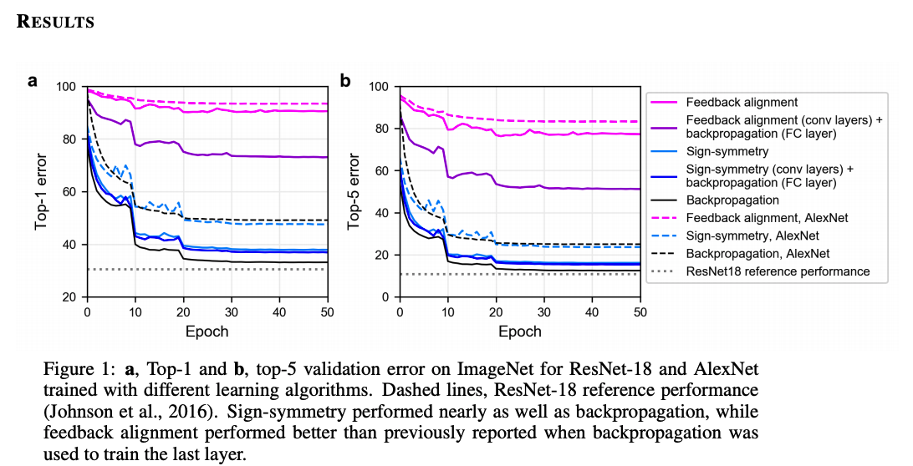
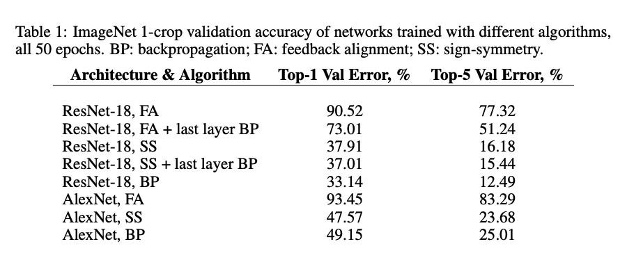
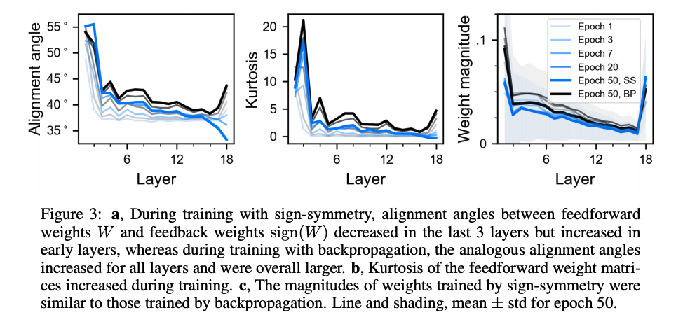

#BIOLOGICALLY-PLAUSIBLE LEARNING ALGORITHMS CAN SCALE TO LARGE DATASETS
[paper](https://openreview.net/pdf?id=SygvZ209F7)

## Abstruct
バックプロパゲーション（BP）アルゴリズムは、脳内では生物学的にあり得ないと考えられがちである。その主な理由の1つは、BPがフィードフォワード経路とフィードバック経路に対称的な重み行列を必要とすることである。この「重み輸送問題」（Grossberg, 1987）に対処するために、Liaoら（2016b）とLillicrapら（2016）によって提案された2つの生物学的にありえないアルゴリズムは、BPの重みの対称性の要件を緩和し、小規模なデータセットでBPと同等の学習能力を示している。しかし、Bartunovら（2018）による最近の研究では、フィードバックアラインメント（FA）とターゲットプロパゲーション（TP）のいくつかの変種は、MNISTとCIFARでは良好な性能を発揮するものの、ImageNetではBPよりも大幅に悪い性能を発揮することが分かっている。ここでは、フィードバックとフィードフォワードの重みが大きさを共有するのではなく、符号を共有するという点でBPとFAの両方と異なるsign-symmetry (SS) アルゴリズム (Liao et al., 2016b) を追加評価した。

ImageNetとMS COCOのデータセットで、異なるネットワークアーキテクチャ（ImageNetではResNet-18とAlexNet、MS COCOではRetinaNet）を用いて、符号の対称性とフィードバックの整合性の性能を調べた。驚くべきことに、符号の対称性を用いて学習したネットワークは、BPで学習したネットワークに近い分類性能を得ることができます。これらの結果は、Bartunovら（2018）の研究を補完し、より困難なデータセットとより複雑なアーキテクチャでの将来の生物学的に妥当な学習アルゴリズムのための新しいベンチマークを確立します。

##1.Introduction
今日の深層学習モデルは、タスクパフォーマンス、有用な表現の学習、さらには脳内の表現のマッチングに大きな成功を収めています（Yaminsら、2014年、Schrimpfら、2018年）。しかし、これらのモデルが脳の学習方法を反映しているかどうかは、依然として論争の的となっています。この問題の核心は、今日のディープネットワークのほとんどの基盤となっている学習アルゴリズムであるバックプロパゲーションが、脳のハードウェアについて分かっていることを考えると、脳に実装するのが難しいという事実にある（Crick 1989; ただし、Hinton 2007を参照）。バックプロパゲーションが脳内で実現できないと思われる主な理由の一つは、フィードフォワードとフィードバックの重みを共有する必要があることです。脳のシナプスは一方向であるため、フィードフォワード接続とフィードバック接続は物理的に区別されます。たとえ学習中に重みが調整されたとしても、その重みを共有する必要があるというのは、非常にありえないことのように思えます。

しかし、Bartunovら（2018）の最近の論文では、フィードバックアライメントと、ターゲットプロパゲーションの亜種を含む他のいくつかの生物学的に妥当なアルゴリズムは、ImageNet（Dengら、2009）のようなより大きくて難しい問題には一般化せず、バックプロパゲーションよりもはるかに悪いパフォーマンスを示すことがわかっている。とはいえ、Bartunovらがテストした特定の条件は、やや制限されています。Bartunovらは，局所的に接続されたネットワークのみをテストしました（つまり，異なる空間的位置にある畳み込みフィルタ間で重みを共有することはできません）．この選択は，生物学的な妥当性に基づいていますが，実際にはネットワークのサイズが制限されており（重みを共有しない場合，各畳み込み層は重みを保存するためにはるかに多くのメモリを必要とします），パフォーマンスの低下がアルゴリズムのみに起因するものなのか，それともこれらのアーキテクチャ上のアルゴリズムに起因するものなのかは明らかではありません1．第2に，Bartunovらは符号対称性をテストしていません．符号対称性のあるフィードバック重みは，フィードバック調整で使用されるランダムなフィードバック重みよりも，フィードフォワード重みに関するより多くの情報を伝える可能性があるため，フィードバック調整よりも強力な可能性があります．

本研究では，標準的なConvNetアーキテクチャ（ResNet-18，AlexNet，RetinaNet）を用いたImageNetおよびMS COCOデータセットにおいて，符号対称性とフィードバック・アライメントの性能を再検討した．その結果，ImageNetではバックプロパゲーションと同等の性能を，MS COCOでは妥当な性能を得ることができました．さらに、バックプロパゲーションを最後の層だけに使用し、それ以外はフィードバックアラインメントを使用することをテストしました。これは、脳では、分類器層は完全に接続された層ではなく、他の不特定のメカニズムを通じてエラー信号を配信する可能性があるという仮説に基づいています。このような部分的なフィードバックアライメントは、Bartunovら（2018）よりも（バックプロパゲーションと比較して）優れた性能を達成することができます。これらの結果を総合すると、これまでの知見が拡張され、既存の生物学的に実現可能な学習アルゴリズムが、人工ニューラルネットワークのトレーニングにも、脳内で学習がどのように起こり得るかをモデル化するにも、実行可能な選択肢として残っていることを示している。

Lillicrapらは、訓練を通じて、平均してe T W Be＞0となるようにWが調整されることを示した（ここでeはネットワークの出力の誤差である）

## 2.Method
## 3.Result

## 4.Disccusion
### 4.1 SS、FA、BPにおける学習の比較
符号の対称性がどのように学習を導くかを理解するために、いくつかの分析を行いました。Lillicrapら（2016）は、フィードバックアライメントでは、フィードフォワード重みがフィードバック重みに合わせるように学習するため、フィードフォワード重みとフィードバック重みの間のアライメント角度が徐々に減少することを示しています。私たちは、Lillicrapら（2016）と同様にアライメント角度を計算することで、符号対称でも同じことが起こるかどうかを尋ねました。フィードフォワードウェイトとフィードバックウェイトの行列のペアごとに、行列をベクトルにフラット化し、ベクトル間の角度を計算しました。興味深いことに、トレーニング中、アライメント角度は最後の3層では減少し、他の層では増加することがわかりました（図3a）。一方、バックプロパゲーションで学習したネットワーク（sign(W)を一切使用していないネットワーク）では、Wとsign(W)の間の角度は、すべての層で増加していた。

このような傾向が見られるのは、学習が進むにつれて、フィードフォワードウェイトが疎になる傾向があるからだと考えられます。幾何学的には、フィードフォワードベクトルは標準基底ベクトルとの整合性が高くなり、構造上常に対角線上に位置するフィードバックウェイトベクトルとの整合性は低くなることを意味します。この説明は、フィードフォワードウェイトの平均尖り度が同様に増加する傾向にあること（図3b）と一致しており、トレーニング中にウェイトの値がより分散されたことを示している。誤差の勾配を計算する際には、フィードフォワード・ウェイトの大きさは無視されるので、符号の対称性が学習されたウェイトの大きさにどのような影響を与えるかについても調べた。符号の対称性とバックプロパゲーションの結果、同じような大きさの重みが得られた（図3c）。符号の対称性が、ネットワークの効率的な学習をどのように導くかについては、さらなる研究が必要である。

### 4.2 なぜ我々の結果は過去の研究と異なるのか

まず、Bartunovらは、フィードバック重みがフィードフォワード重みに関する追加情報を持つことができるフィードバックアライメントの特殊なケースであるため、フィードバックアライメントよりも強力であると予想されるsign-symmetryをテストしていません。実際、ImageNetにおいて、sign-symmetryの性能はbackpropagationの性能に近づき、feedback alignmentの性能を大差で上回った。もう1つの理由は、ImageNetで標準的なConvNetsを使用する代わりに、Bartunovらは局所結合ネットワークのみをテストしたことにあるかもしれません。局所結合型ネットワークは、生物学的にはより妥当なアーキテクチャですが、実際には、空間的な位置ごとに別々の重みを保存する必要があるため、サイズが制限されます。

このモデル容量の減少は、フィードバックアライメントのパフォーマンスに影響を与える可能性のあるボトルネックを生み出します（Lillicrapら、2016、補足注9参照）。最後に、フィードバックアライメントの性能は、最後の層にバックプロパゲーションを使用することでも恩恵を受けました。の条件を満たしています。

### 4.3 より生物学的に妥当な学習アルゴリズムを目指して

##5.Conclusion
最近の研究では、生物学的に妥当な学習アルゴリズムは、ImageNetのような困難な問題には対応できないことがわかっています。我々は、ImageNet上でResNetとAlexNetを、MS COCO上でRetinaNetを学習する際の効果について、符号対称性を評価し、フィードバックアライメントを再評価した。

符号対称性は，ImageNetにおいてバックプロパゲーションとほぼ同等の性能を示し，2）わずかに修正したフィードバックアライメントは，これまでの報告よりも優れた性能を示した。これらの結果から、人工ニューラルネットワークの学習や脳内学習のモデル化には、生物学的に妥当な学習アルゴリズム、特にsign-symmetryが有望な選択肢であることが示された。

