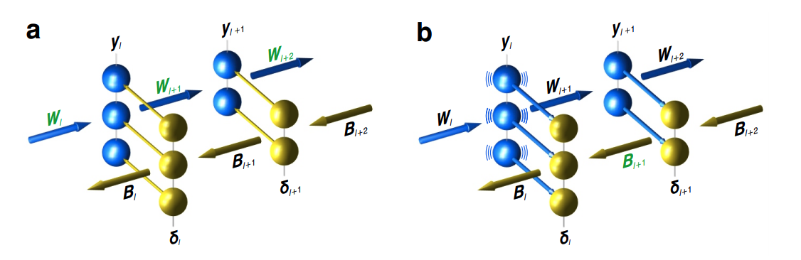
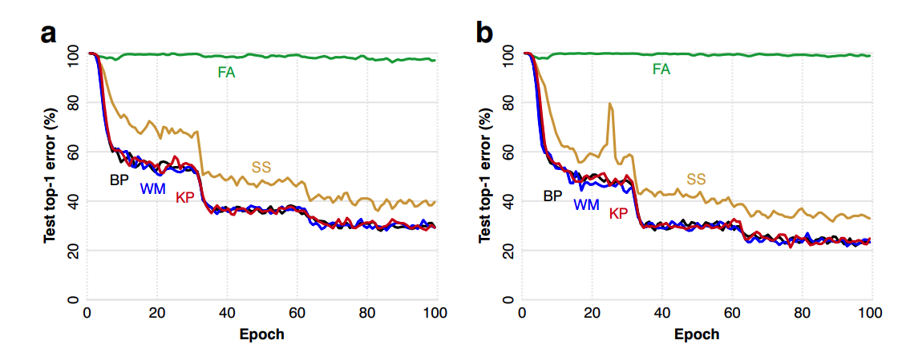
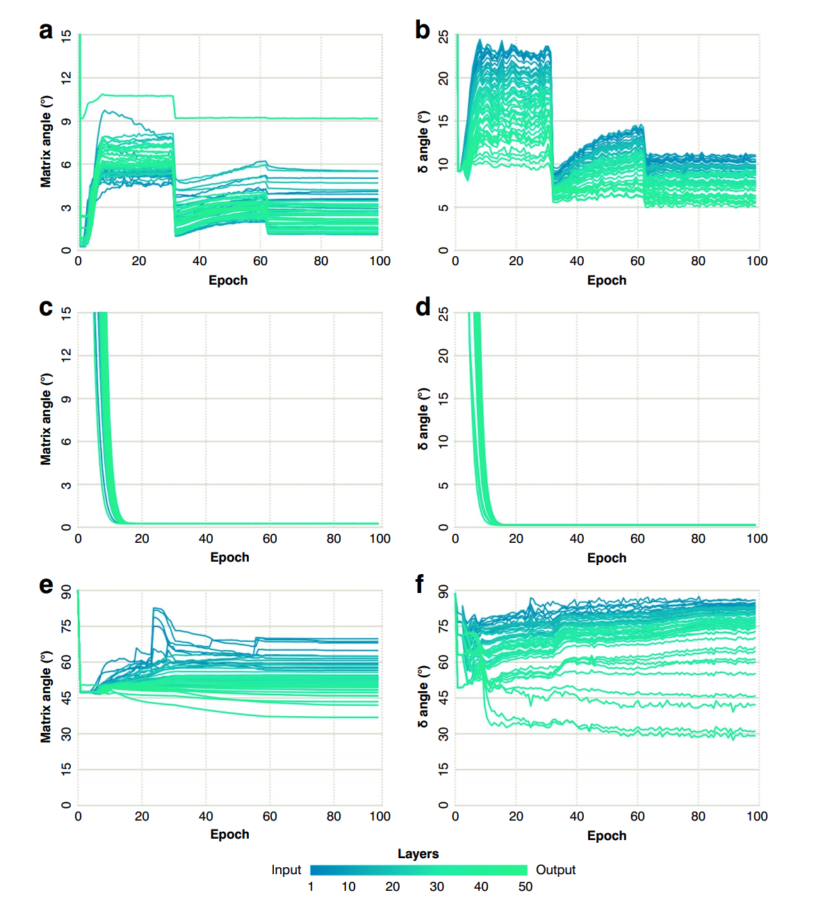
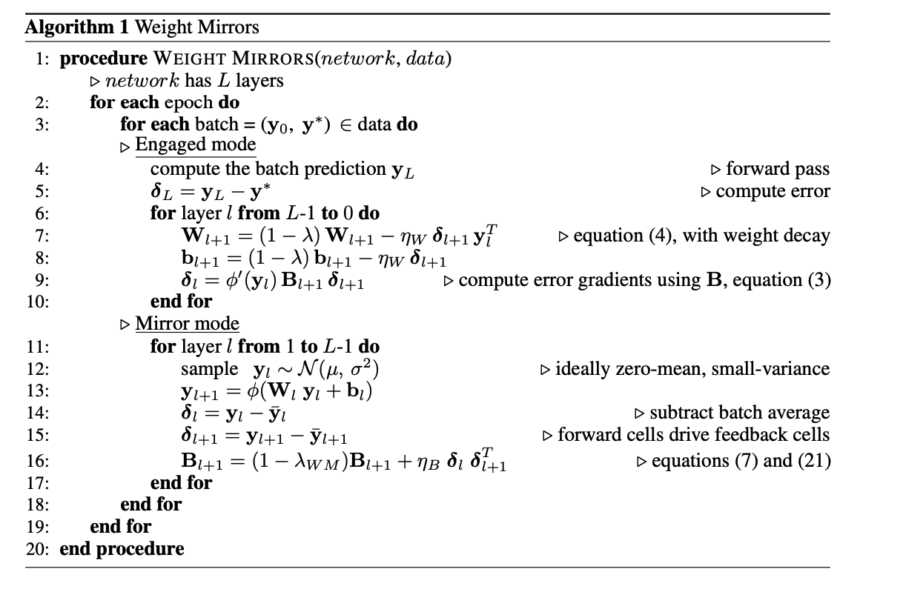
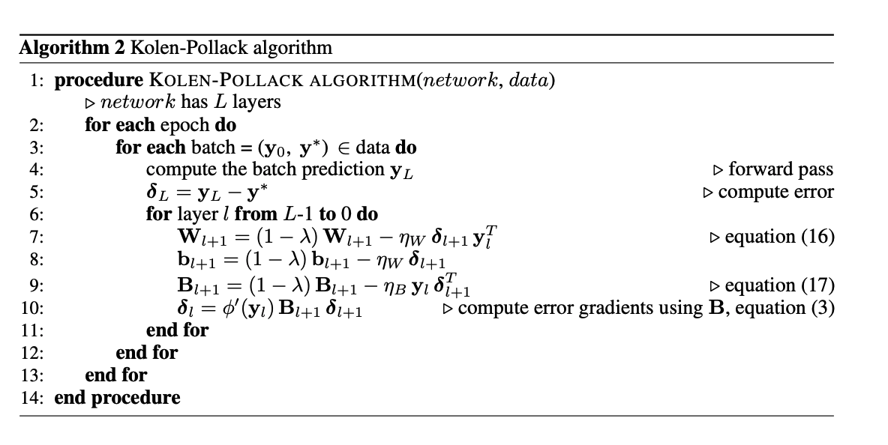

#Deep Learning without Weight Transport
[paper](https://papers.nips.cc/paper/2019/file/f387624df552cea2f369918c5e1e12bc-Paper.pdf)

## Abstruct
現在の深層学習のアルゴリズムは、生物学的に不可能と思われる方法で、順方向のニューロンがシナプスの重みをフィードバック経路に伝達する重み輸送に依存しているため、おそらく脳内で実行することはできない。フィードバック・アライメントと呼ばれるアルゴリズムは、ランダムなフィードバック重みを用いることで、重み輸送なしに深層学習を実現しているが、難しい視覚認識課題では性能が低い。ここでは、ウェイトミラーと呼ばれる神経回路と、1994年にKolenとPollackが提案したアルゴリズムの改良という2つのメカニズムについて説明する。これらのメカニズムにより、フィードバックパスは、大規模なネットワークにおいても、ウェイトトランスポートや複雑な配線なしに、適切なシナプスウェイトを迅速かつ正確に学習することができる。ImageNetの視覚認識タスクでテストしたところ、これらのメカニズムは、backprop（重量輸送を用いる深層学習の標準的なアルゴリズム）とほぼ同等の学習を行い、feedback alignmentや、最近開発された輸送を用いないアルゴリズムであるsign-symmetry法よりも優れていました。

## 1.Introduction
Lillicrapら[3]は、重みの伝達なしに深層ネットワークを学習させるメカニズムであるフィードバック・アライメントという形で解決策を提示し、いくつかのタスクで良好な結果を報告した。しかし、Bartunovら[4]とMoskovitzら[5]は、フィードバック・アライメントがImageNet[6]のような難しい視覚認識問題には対応できないことを明らかにした。Xiaoら[7]は、フォワードウェイトとフィードバックウェイトの符号のみが対応し、その値は必ずしも対応していないという符号対称アルゴリズムを用いて、ImageNetで良好な性能を達成し、その対応関係が脳の発達過程で設定される可能性のあるメカニズムを提案しています。

KrotovとHopfield[8]およびGuerguievら[9]は、重み輸送を伴わない深層学習の他のアプローチを探究しているが、これまでのところ、より小さなネットワークとタスクにおいてのみである。ここでは、符号が一致するようにフォワード行列とフィードバック行列を初期化する必要がなく、バックプロップと同程度にImageNetを学習する2つの異なるアプローチを提案します。

重みミラーと呼ばれる回路と、1994年にKolenとPollackによって提案されたアルゴリズムのバージョンについて説明します[10]。この2つのアプローチでは、最初はランダムなフィードバック重みが、重み輸送なしに適切な値を学習します。

もちろん、深層学習アルゴリズムの生物学的な意味合いについては他にも疑問があり、そのいくつかについては付録Cで触れていますが、本稿では重量輸送を主な関心事としています。

## 2.Weight-Transport problem 
フィードバックパスは学習を導くエラー信号を伝える。

φ 0は式(1)の活性化関数φの微分であり，ylから計算することができる．つまり、フィードバック信号は重みWT lを介して層ごとに通過することになります。

脳の構造として解釈すると、フィードバック経路は、前進経路のニューロンとは異なる別のニューロンのセットかもしれませんし、同じニューロンのセットが一方で推論信号を運び、もう一方でエラーを運ぶかもしれません [12, 13]。いずれにしても、同じ重み行列Wlが前進式(1)に現れ、フィードバック式(2)では転置されて再び現れるという問題があるが、脳内では前進経路とフィードバック経路のシナプスは物理的に異なるものであり、それらを調整する方法は知られていないので、一方のセットは常に他方の転置となる[1, 2]。

## 3. feedback alignment
フィードバック・アライメントでは、フィードバック経路にある転置されたWlを、ランダムな固定の(学習しない)重み行列Blに置き換えることで、この問題を回避している。

3]で示したように、式(1)、(3)、(4)を合わせると、フォワード行列Wlは、フィードバック行列Blの転置にほぼ比例するようになる。この大まかな転置により、式(3)はバックプロップの式(2)とよく似ており、ネットワークはバックプロップと同様に単純なタスクを学習することができる。では、より難しい課題に対応するために、フィードバックの調整を強化することは可能でしょうか

## 4.weight mirrors
### 4.1 Learning transpose
E x yT = E x xTWT = E x xT WT となる。

最も単純なケースでは、xの要素が独立しており、ゼロ平均で等分散のσ2である場合、E x yT = σ 2WTとなります。

したがって、この転置則を用いて、∆B = ηB x yTとなり、Bをσ 2Wの方向に安定して押すことができます。

Bは平均的にWTに比例した信号を積分していることになります。しかし、重みの減衰やシナプスのスケーリング[14-16]のように、ノルムを小さく保つメカニズムを追加すれば、Bの初期のランダムな値は縮小し、BはWTのスカラー倍数に収束する(この学習規則を勾配降下法で説明したものは付録Aを参照)。
### 4.2 circuit for transpose
このネットワークは、感覚的な入力を受け取り、推論を向上させるために前方の重みを調整する「エンゲージメントモード」と、ニューロンが騒々しく放電する「ミラーモード」の2つのモードを交互に繰り返します。
このネットワークは、感覚入力を受け取り、推論を向上させるためにフォワードウェイトを調整する「関与モード」と、ニューロンが騒々しく放電し、フォワードウェイトを模倣するようにフィーダックウェイトを調整する「ミラーモード」の2つのモードを交互に繰り返します。

生物学的には、この2つのモードは、覚醒と睡眠に対応しているのかもしれないし、単にタスクを練習してから一旦脇に置いておくことにも対応しているのかもしれない。

a) エンゲージドモードでは、クロスプロジェクション（ ）がフィードバック信号δをフォワードパスセルに伝えるので、学習則（4）を用いてフォワードウェイトWを調整することができる。

b) ミラーモードでは、フォワードセルの1つの層（例えば層l）が騒々しく発火する。その信号 yl はまだ Wl+1 を通過して yl+1 が得られるが、今度は青色のクロスプロジェクション( )がフィードバックパスの発火を制御するので、δl = yl、δl+1 = yl+1 となり、δl ニューロンは学習則(7)を用いてフィードバック重み Bl+1 を調整することになる。この回路 yl , yl+1, δl+1, δl は、重み配列Bl+1をWT l+1に似せていることから、重みミラーと呼んでいる。

ミラーモードでは、信号ylを持つ各層lのフォワードパスニューロンは、フィードバックパスの層lに強く投影され、フィードバックパスの各信号δlがylを忠実に模倣するほど強く投影されます、つまりδl = yl (6) 

また、ミラーモードでは、フォワードパスの信号 yl にはノイズが含まれています。複数の層が同時に発火することもありますが、交互に発火する場合の方が、プロセスの説明が簡単で、常に1つの層lだけがフォワードパスの活動を駆動しています。この場合、層lのすべてのセルはランダムに独立して発火するので、その出力信号ylはゼロ平均と等しい分散σ2を持っています。この信号は、順方向の重み行列Wl+1と活性化関数φを通過し、 yl+1 = φ(Wl+1 yl + bl)となる。

## 5. The Kolen-Pollack algorithm
### 5.1 Convergence through weight deca
KolenとPollack[10]は、重みの変化を伝えることができれば、重みを伝える必要はないと述べている。2つのシナプス、前進経路のWとフィードバック経路のBを考える（太字で書かれていないのは、今のところマトリックスではなく個々のシナプスを考えているからである）。WとBは最初は不平等であるが、各時間ステップtにおいて同一の調整A(t)を受け、同一の重み減衰係数λを適用するとする。

KolenとPollackは、彼らのアルゴリズムが脳内でどのように実行されるかについては述べていない。KolenとPollackは、彼らのアルゴリズムが脳内でどのように実行されるかについては述べていない。彼らのフロー図（論文中の図2）は、まったく生物学的ではない。重みの変化が1つの遺伝子座で計算され、フォワードパスとフィードバックパスの異なるシナプスに伝わることを示している。脳内では、異なるシナプスへの変化は、ほぼ確実に、シナプス自体の中で別々に計算される。しかし、KolenとPollackの方法は、重みや重みの変化を輸送することなくネットワークに実装することが可能である。

### 5.2 A circuit for Kolen-Pollack learning
標準的な、順路学習規則(4)では、行列Wl+1はその入力ベクトルylと教示ベクトルδl+1の積に基づいて自身を調整するとしている。具体的には、各シナプスWl+1,ijは、自身のスカラ入力yl,jとフィードバック経路から自身のニューロンに送られるスカラ教示信号δl+1,iに基づいて自身を調整する。我々は、フィードバック経路のシナプスが、自身の入力とフォワード経路からの細胞固有のスカラー・ティーチング信号に基づいて自身を調整するという、相互の配置を提案する。

このネットワーク（図2に描かれている）では、細胞間で伝達される変数は活動ベクトルylとδl+1だけで、各シナプスは局所的に自分の調整量を計算するが、(16)と(18)はKolen-Pollack方程式(13)と(14)の形をしているので、フォワードとフィードバックの重み行列は互いに転置し合う形に収束する。

## 6.Experiment
ウェイトミラーネットワークとKolen-Pollackネットワークを，backprop， plain feedback alignment，sign-symmetry法[5, 7]と比較した．生物学的に動機づけられたアルゴリズムに関する最近の論文[4, 5, 7]と比較しやすいように、彼らと同じタイプのネットワークを使用し、コンボリューション[18],バッチ式正規化(BatchNorm）[19]と，バイアス・ブロックのない整流線形単位（ReLUs）を使用しました。

ReLUの非線形性の前にバッチ正規化を適用した他の実験では，sign-symmetryがよりよい結果を示した．これらの実験では、ResNet-18で37.8(4)%（同じネットワークについて[7]で報告された37.91%に近い）、ResNet-50で32.6(6)%のトップ1テストエラーを達成しました（ハイパーパラメータ選択の詳細については付録D.1を、sign-symmetryがテストで達成した最良の結果の図については付録D.3を参照してください）。

図4: 図3bのResNet-50におけるフォワード行列とフィードバック行列の一致 a) ウェイトミラーは、入力層（-）から出力層（-）までのすべての層で、行列BlとWT lの間の角度を小さく保った。 b) ウェイトミラーネットワークによって計算されたフィードバックベクトルδlも、バックプロップによって計算されたであろうものとよく一致した。

BatchNormに同じ変更を加えても、他の4つの手法（backprop、feedback alignment、Kolen-Pollack、weight mirror）にはほとんど違いがありませんでした。ウェイトミラーは、図4に示すように、トレーニング中、フォワードマトリックスとフィードバックマトリックスを一致させ続けた。

ネットワークの各層で、フィードバック行列Blとフォワード行列の転置行列WT lを取り、それらをベクトルに整形します。バックプロップでは、これらのベクトル間の角度は当然ながら常に0でした。

ウェイトミラーを使用した場合（図4a）、角度はすべての層で12°以下に保たれ、最終層を除くすべての層で実行後に6°以下となりました。

最後の層は完全に接続されているため、そのWlは他の畳み込み層よりも多くの入力を受けており、そのWT lを推測することは困難でした。

 このように、WT lをより正確に推定するためには、より多くの例を用いた長時間のミラーリングが必要でした。

エポック2から10までの間に行列の角度が大きくなり、その後エポック32まで比較的高いレベルで安定していたのは、この期間に学習率ηWが大きかったため(付録D.1参照)、ミラーリングによってBlと変化の速いWT lの一致が保たれなかったためです。

この問題は、より多くのミラーリングを行うことで解決することも可能でしたが、エポック32ではηWが90%縮小し、それ以降はBlとWT lがより良く一致するようになったため、問題はありませんでした。

また、ウェイトミラーネットワークによって計算されたフィードバックベクトルδlと、バックプロップによって計算されたフィードバックベクトルδlとの間のδ角を計算しました（Bl'sを使用）。

ウェイトミラーは、すべての層でこれらの角度を25°未満に保ちましたが（図4b）、上流ほどアライメントが悪くなりました。

これは、δ角が、下流のすべての層のすべてのBlとWT l'sの間の小さな不一致の累積に依存するためです。

Kolen-Pollackネットワークはさらに精度が高く、図4c、4dに示すように、行列とδ角を20エポック以内にゼロに近づけ、そこに保持した。

符号対称法では、行列とδの角度があまり正確に揃わなかったが（図4e、4f）、フィードバック・アライメント（図示せず）では、ResNet-18とResNet-50の両方のアーキテクチャにおいて、ほとんどの層で両角度が80°以上に保たれた。

## 7.Discussion
ウェイトミラーとKolen-Pollackネットワークは、フィードバック・アライメントや符号対称アルゴリズムよりも優れており、少なくとも大まかにはbackpropと歩調を合わせていました。

Kolen-Pollackには、重量ミラーと比較して、別々の動作モードを必要とせず、レイヤーごとに進める必要がないという利点があります.
逆に、ウェイトミラーは感覚入力を必要とせずノイズから学習するので、睡眠中や胎児の時にフィードバック経路を調整することができるのです。

また、図4でKPはWMに比べて行列とδの角度を小さくしていますが、すべての学習課題でそうなるとは限りません。

KPの場合、行列Bは式(17)の重み減衰係数であるλに依存した速度でWTに収束します。現時点では、λと学習率ηWの間に常に良いバランスが得られるという証明はありませんが、大きなλはアライメントを高速化しますが、学習を妨げる可能性があります。この点では、WMはKPよりも汎用性が高いかもしれません。ミラーリングで十分に小さい角度が得られなかった場合、スリープなどでさらにミラーリングを行えばよいからです。

さらなるテストが必要です。

この2つの方法は、生物学以外の分野にも応用できるかもしれません。というのも、重量輸送を持たないコンピューティングデバイスは脳だけではないからです。ある情報は活動電位にコード化されています。活動電位はエネルギー的に高価ですが、脳の他の部分に素早く伝達されます。一方、別の情報はシナプスの重みに保存されています。シナプスの重みは安価でコンパクトですが、局所的なもので、伝達可能な信号に影響を与えますが、それ自体は伝達されません。同様の問題は、ASIC（特定用途向け集積回路）のようなある種の技術でも発生します。脳と同じように、ウェイトミラーリングやKolen-Pollackのようなメカニズムによって、フォワードウェイトとフィードバックウェイトをローカルに格納し、時間とエネルギーを節約することができます[20-22]。

## Appendices 
### A 勾配降下法としての転置ルール
学習規則(5)は、勾配降下法の一形態として表すことができ、∆B = η x yT = -η ∂f ∂B (19) ここで、f(x, y, B) = -x T By = - X i,j xi yj Bij (20) 

この関数fは、固定されたゼロではないxとyに対して最小値を持たないため、損失関数でも目的関数でもなく、また、Bをどんどん大きくすることでゼロよりも遠くに押すことができるため、最小化したい量でもありません。

しかし、(5)と重み減衰ΔB = ηB x yT - λWM B (21)を組み合わせると、損失の勾配を降りることができます。
### B  計算コスト
ウェイトミラーリングは、Kolen-Pollack学習よりも若干計算量が多い。

学習ネットワークの層lとl＋1が完全連結で、前進ユニットがnlとnl＋1（前進ユニットとは別にフィードバックユニットがある場合は同数）あるとし、n＝min(nl , nl＋1)とする。

そして、各学習例に対して、KPは式(17)を用いてn + 4nl+1回のフロップを行い、Bl+1を調整する。

WMは同じ数だけ式(21)を使ってBl+1を調整するが、WMはさらにランダムなベクトルylを生成し、式(1)を使ってylからyl+1を計算するために約2nlnl+1のflopsを行う必要があるが、KPはフォワード行列を訓練するのと同じylとyl+1を使う。

### C 
C.1  Distinct feedback neurons?

フォワードパスとフィードバックパスが異なるニューロンのセットである場合、我々の提案する方法では、フォワードパスの各セルとフィードバックパスのパートナーセルを1対1で接続する必要がある。

このような接続は、発生過程で生じる可能性がある。線虫のような単純な生物[23]や昆虫の複眼[24]では、正確で一貫性のあるニューロンの配線が見られることがわかっているし、少なくともいくつかの哺乳類の種の大脳では、各プルキンエ細胞が正確に1本の適切な登攀繊維と接続している[25]。

あるいは、厳密な一対一の配線でなくても、効果的な学習には十分であり、それ自体が学習されることもある。一対一の対応を得るためには、同じニューロンがフォワードパスとフィードバックパスを構成していれば、もちろん些細なことですが、そうすると、信号yとδがどのようにして干渉することなく同じ細胞を流れるのかを説明するという、信号分離という新たな問題に直面します。

可能性としては、ニューロンがyとδを別の細胞内メッセンジャーで伝達したり、細胞内の別の場所で計算したりすることで分離しているか[26]、あるいは多重化することで分離しているか[27]、あるいは細胞が交互にどちらかの信号を伝達することで分離しているかが考えられます。

C.2 Zero-mean signals
式(11)では、学習則(7)の根拠を示しましたが、そのためには信号ylの平均値がゼロであることを仮定しなければなりませんでした。

なぜなら、ニューロンの発火率は負の値をとることができず、完全に沈黙する以外には平均値をゼロにすることができないからです。

しかし、ニューロンはベースラインレートβに基づいて変調することで正負の値を伝達すると仮定すれば、ゼロ平均の必要性はなくなります。

 例えば、 yl+1 = φ Wl+1(yl - β) + bl+1 (23) ここでφは非負の活性化関数であり、yl - βは信号ベクトルylの各要素から同じスカラーβを引くことを意味する。

ミラーモードでは、ylは0ではなくβの平均値でノイズ的に発火する可能性がある。バイアスブロッキングの変形として、bl+1をb-に設定する方法がある。b-は、φ（b-）＝β、φ0（b-）＞0となるように選択されたデフォルトのバイアスである。そして、∆Bl+1 = ηB (δl - β)(δl+1 - β) T (24) ベースラインβは、ゲノムによってニューロンに組み込まれている場合もあれば、実験で行ったように、ミラーリング期間中の発火率の平均を取るなどして、局所的に推定する場合もある。

脳内で正負の信号を得る別の方法として、各処理ユニットを単一のニューロンとしてではなく、正の信号を運ぶものと負の信号を運ぶものがいる、プッシュプルで作用する細胞のグループとして考えることができます[28]。ベースラインとプッシュプルという両方のメカニズムが脳内で作動しており，たとえば前庭眼球反射[29]などがそうである．

C3 多目的プロジェクション
C.4 マルチレイヤー・ミラーリング 

###D Experiment detail
D.1 training

号対称性アルゴリズムでは、収束を確認するために140エポックまで学習を行いながら、学習率を[0.01, 2.0]の範囲でグリッド検索を行いました。ResNet-18とResNet-50の両方で、0.5が最も低いトップ1エラーを与えることがわかり、すべての符号対称性の実験でこの値を使用しました。その他、すべてのアルゴリズムのハイパーパラメータ（ミラーモードのものを除く）は、フォワードパス・ネストロフ・モメンタム[32]0.9、重み減衰係数（L2正則化）λ10-4など、[31]から引用しました。TF-Replicator [31]を用いて，32台のTPU v2ワーカーに学習を分散させ，合計2048枚のミニバッチを作成しました．ηWは最初の6つのエポックで直線的に成長し（ウェイトミラーネットワークの場合は3〜8のエポックで成長）、エポック32、62、82の後に10倍に縮小するという、[31]のアニーリングスケジュールを適用しました。

D.2 ミラーリング

各ウェイトミラーネットワークは、最初の2エポックを完全にミラーモードで過ごし、初期のランダムなウェイトを整合させました。その後、各ミニバッチのエンゲージドモード学習の後に少量のミラーリングを行いました。ミラーリングは層ごとに行われました。第l層にノイズの多い活動の新しいミニバッチ（ミラーリングのミニバッチに含まれる2048個の例の平均値がゼロで分散が単位の独立したガウス信号）を作成し、その信号を畳み込み層とReLU関数に送りました。そして、ミニバッチ全体のReLU後の出力の平均値を計算し、各層で平均値ゼロの出力が得られるように差し引きました。

式(21)と同様に，これらのゼロ平均信号の共分散行列を乗算し，ミニバッチで平均化することで，共分散を推定した。畳み込み層では，重みが共有されているため，各重みが複数の入出力を接続しており，その重みが接続している入出力のペアの共分散の推定値を平均することで，任意の重みに関連する共分散を推定した。この共分散の推定値を用いて，学習率係数ηBを0.1，重み減衰λWMを0.5として，(21)のようにフィードバック重みを学習しました。

D.3 バッチ正則化

ウェイトミラーと Kolen-Pollack は、フィードバック行列 Bl をフォワード行列 Wl に一致させることを学習したが、フォワードパスで使用されるバッチ正規化パラメータ ベクトル µ や σ を再現しようとはしなかった。というのも、Bl の行列は Wl の行列と同じ畳み込み型の重み共有構造を持っており、µ と σ はこの構造を無視していたからです。

そのため、スケーリング・パラメータσをフォワード・パスからフィードバック・パスに単純に渡しました (μは必要ありません)。この転送は、フィードバックニューロンごとに1つのスカラー変数という非常に小さな情報しか含まれていないため、畳み込みの代わりに重み共有のない、より生物学的な局所接続を用いれば、避けることができます。

 ほとんどの実験では、活性化関数の後に一括して正規化を適用しましたが、符号対称法では、[30]のように活性化の前に正規化を適用した方が、わずかに良い学習ができました。セクション6では、両方のケースの数値結果を示しましたが、ここでは、我々のテストでsign-symmetryが達成した最高の結果である、ResNet-50アーキテクチャでの32.6(6)%の最終誤差の図も示します。

### E code

