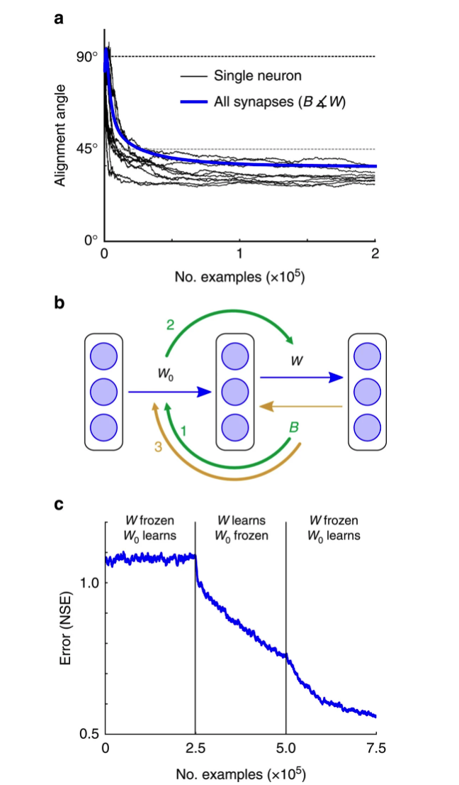

#feedback alignment
[paper](https://www.nature.com/articles/ncomms13276)

## Abstruct
脳は何層ものニューロンを介して情報を処理しています。この深いアーキテクチャは表現力に優れていますが、間違いを犯したときに責任のあるニューロンを特定するのが難しいため、学習が複雑になります。
機械学習では、バックプロパゲーション法と呼ばれるアルゴリズムを用いて、各ニューロンの軸索とその下流にあるすべてのシナプスの重みにエラー信号を乗じることで責任の所在を明らかにする。しかし、これには正確で対称的な後方接続パターンが必要であり、脳では不可能であると考えられている。本研究では、このようなアーキテクチャ上の強い制約が、効果的なエラー伝搬には必要ないことを示した。我々は、エラーにランダムなシナプスの重みを乗じることで責任を負わせるという、驚くほど単純なメカニズムを提示する。このメカニズムは、複数のニューロン層にティーチング信号を伝達することができ、さまざまな課題においてバックプロパゲーションと同等の効果を発揮する。今回の成果は、脳がエラー信号をどのように利用しているのかという疑問を再提起するとともに、学習に対するアルゴリズム上の制約についての長年の思い込みを払拭するものである。

## 1.Introduction
脳内のネットワークは、複数のニューロンが相互に接続された複数の層で構成されている。学習時には、これらのニューロンがシナプスを調整することで、ネットワークの出力がタスクに適したものになると考えられている。多くの場合、学習には、期待した知覚と実際の知覚の間のミスマッチや、意図した運動行動と実現した運動行動の間のミスマッチなどのエラー信号が利用されると考えられている1,2,3,4,5,6,7,8。そのためには、ネットワークの初期段階にあるシナプス（例えば、図1aのxiとhjの間のシナプス）の重みを、下流のエラーに基づいて調整できるメカニズムが必要となる 

 ナイーブな学習規則は、スカラーエラー信号とニューロン活動の相関関係に基づいて、ネットワークの奥深くにあるシナプスを調整することができる9。しかし、このような学習規則は、ネットワークのサイズが大きくなるにつれて性能が著しく低下する10,11。これは、ネットワーク内のニューロンの数が増えると、誤差に対するニューロンの寄与度の推定値のばらつきが大きくなるためである12。より強力な学習ルールでは、ニューロンがどのようにエラーに寄与したかに基づいて、特定のティーチング信号をニューロンに送ることができます13。人工知能では、誤差のバックプロパゲーション（backpropation of error）と呼ばれるアルゴリズムを用いて、ニューロンごとに誤差を割り当てています14（図1a）。バックプロップは実世界のアプリケーションでうまく機能し、最近の強化学習や教師なし学習15,16,17の基盤となっており、大脳皮質の一部の領域における細胞の反応を説明することができます18,19,20。しかし、さまざまな理由から、バックプロップのような学習アルゴリズムが脳内の神経回路にどのように実装されるのかを想像することは困難でした21,22。
 
最も重要な問題の1つは、バックプロップが、下流の誤差を、下流のシナプス重み行列の正確な対称コピーを介して上流のニューロンにフィードバックすることを必要とすることである。

バックプロップは各シナプス出力から軸索に沿って戻る迅速な情報伝達を必要としているようだと指摘しました。

多くの研究が行われてきました。実際、初期の経験的観察に後押しされて、いくつかの理論的研究では、軸索に沿った情報の逆行性伝達によって実際に逆進が行われる可能性が検討されました28。しかし、逆行性輸送は、前方に伝搬する神経活動よりも桁違いに遅いタイムスケールで動作するため、バックプロップのような学習をサポートすることは基本的に不可能であることが、さらなる経験的研究によって明らかになった26。エラー情報を逆行して送信する代わりに、エラーを第2のネットワークを通してフィードバックする方法も提案されている4,21,23,24,25,29,30,31,32。

これらのアプローチのほとんどは，フォワード接続とフィードバック接続が対称であることを前提としているか，あるいは，正確な対称性を維持するためにバックワードウェイトのより複雑な学習規則を提案している．重みの輸送問題に対するこれらのアプローチは、バックプロップのような学習性能を達成するためには、脳が上流と下流のニューロン間で正確な対称性のある接続を示さなければならないという見解を永続させるのに役立った。しかし、脳には、層を超えてエラー情報を伝達するのに適した広範な相互接続性が存在するものの、そのような正確な相互接続性のパターンはないと考えられている21。

その結果、バックプロップが仮定するような、接続された層間の正確な対称性のある接続性は、迅速な学習を得るためには必要ないことがわかりました。驚くべきことに、固定されたランダムな接続パターンでも十分な効果が得られることがわかった。また、フィードバック接続を調整することなく、標準的な順方向の重み更新に含まれる暗黙のダイナミクスが、順方向の重みと逆方向の重みの間のソフトな調整を促し、複数の層にわたるニューロンごとのエラー信号の効果的な流れを可能にすることを示している。この単純なメカニズムは、シナプスの重み情報の伝達をすべて回避し、相互接続性の対称性がわずかしかないにもかかわらず、これを実現している。もちろん、これらの観察結果は、脳がより複雑な構造やより複雑なアルゴリズムを利用している可能性と矛盾しない。また、今回の結果は、脳がどのようにして高速なエラー駆動型学習を実現しているのかについて、多くの疑問を残している。しかし重要なのは、複数のニューロン層にまたがって効果的にエラーを伝播させるために必要なアーキテクチャ上の制約がはるかに小さいことである。

## Results
### Random feedback weights can deliver useful teaching signals
何らかの方法で前方経路のすべてのシナプス重みWを知る必要があることを意味する。

私たちのアルゴリズムは、3つの洞察に基づいています。(i) フィードバックの重みは正確にWTである必要はない。実際には、平均してeTWB e>0であれば、任意の行列Bで十分です。幾何学的には、行列B eが送るティーチング信号は、backpropが使用する信号WTeの90°以内にあることを意味します。つまり、Bはbackpropとほぼ同じ方向にネットワークを動かすことになります。しかし、学習速度を上げるためには、BとWTの間のより良い一致が必要です。(ii) そのためには、BとWTが一致するようにネットワークを進化させることが考えられます。Bを調整するのは当然ですが、(iii)Wを調整することで同じことを行うことも可能です。これは、固定のランダムなBであっても、非常に簡単に実現できることを示します(図1c)。実際、私たちのシミュレーションは、これが最小限の要件であり、同じ効果を得るためには多くの方法があることを示唆しています。

式(1)は、誤差ベクトルeが軸索のセットを介して運ばれ、シナプスの配列Bを通過してベクトルB eを得ることを意味する。δを運ぶ軸索の枝が隠れた層のニューロンに接触して学習を調整するので、B eのベクトルをδ（モジュレーター信号）とも呼ぶ（図1d）。例えば、ニューロンjは信号δj（δのj番目の要素）を受け取り、ニューロンj上のシナプスiの重み変化は、δjとそのシナプスへの入力xiとの積に比例する（非線形の場合は出力ニューロンの活動の単純な関数となる、後述）。したがって、このメカニズムでは、学習細胞ごとに1つのモジュレータ信号が必要となり、それがその入力順シナプスでの可塑性に影響を与えることになる。我々が検討した単純なモデルでは、送出されたδFA信号は前方パスのシナプス後の活動には影響を与えず、前方シナプスでの可塑性を変化させるように作用する。このような前方と後方の活動の切り離しは、脳内でさまざまな方法で起こる可能性があります。

例えば、異なる時間に到着する入力や、異なる細胞内コンパートメントへの入力33,34,35,36、または異なるタイプのシナプス37,38を介して行われます。より複雑なモデルでは、シナプス後の電圧を介して相互作用する前方経路と後方経路が含まれ、推論プロセスと学習プロセスが相互に作用するようになっているかもしれない（考察参照）。

浅い学習では、出力の重みWだけが調整され、結果的に損失がほとんど減らないことがわかった。各ニューロンに同じ報酬を与える高速な強化学習では、W0とWの両方が調整されますが、学習速度は遅くなります。一方、バックプロップでは、損失が急速にゼロに向かっていきます。驚くべきことに、feedback alignmentも同じように素早く調整されます。その理由を探るために、フィードバック・アライメントで規定されるモジュレータ・ベクトルδFA=B eと、バックプロップで規定されるモジュレータ・ベクトルδBP=W Teとの間の角度をプロットしてみました（図2b）。最初、この角度は約90°でした。しかし、固定されているにもかかわらず、BがWTのように振る舞い始めるため、すぐに角度は縮まります。このようにして、ランダムなフィードバックウェイトBは有用なティーチングシグナルを発信するようになります。注目すべきは、角度が小さくなっても、ゼロにならないことです。このことは、角度がゼロでない場合でも、フィードバックアライメントはバックプロップと同程度の性能を得ることができることを強調しています。このように、エラーフィードバックは、正確で対称的なバックワード接続を介して行われなければならないというわけではありません

### Feedback alignment learns under a variety of conditions
単純な線形問題を検討した後、我々は、シナプスの変化がシナプス前の活動や変調器の信号だけでなく、シナプス後のニューロンの活動にも依存する非線形ニューロンでも、フィードバック・アライメントが機能するかどうかを試してみたかった。この場合、出力hjとシグモイド非線形性を持つ隠れユニットは、シナプス後の活動の単純な関数である3因子式によって、入力されるシナプスの重みを更新する（「方法」を参照）。非線形フィードバックアラインメントは、手書きの数字を認識する学習というベンチマーク問題でテストされた（図3a；方法を参照）。

この課題では、backpropは、20回の実行を平均して、テストセットの平均誤差を2.4%に抑えた。フィードバック・アライメントも同様に早く学習し、平均誤差2.1%を達成し、同様の特徴検出器を開発した（補足図5）。この非線形実験では、変調器の信号δFAとδBPもすぐに整列し、時間が経っても安定しています（図3b）。また、W行列とB行列の要素のうち50％をランダムに取り除き、hとyのニューロンが相互に接続する確率を25％にしても、フィードバックの整合性はバックプロップと一致する（平均誤差2.4％、n=20、補足図5）。これらのテストは、単純な線形のケースから得られた結論を支持し、フィードバックアラインメントは非線形の場合にもロバストであり、回帰誤差と同様にカテゴリー誤差でも効果的に機能することを示している。

我々が行った深層ネットワークの実験では、フィードバック・アライメントによって、複数の隠れた層にδ信号を送ることで、深層ネットワークを学習できることが明らかになった。例えば、4層のネットワークでは、誤差ベクトルeを持つ軸索がシナプスB2を通過して、δ2=B2eが得られる（図3c）。δ2を持った軸索は、隠れ層2の細胞に枝を送って学習を調整し、さらに重み配列のB1を通過してδ1=B1δ2となる。4層のネットワークを用いて関数のフィットタスクをテストしたところ、フィードバックアライメントはバックプロップと同等の性能を発揮しました（図3d）。また、feedback alignment（t-test, n=20, P=9×10-13）、backprop（P=3×10-12）ともに、4層のネットワークでは3層のネットワークよりも良い性能を示した。第1層の重みW0を固定した対照実験では、フィードバック・アライメントは、深い層で効果的な重みの更新を行うことで、深さを利用していることが確認された（補足説明2、3、補足説明図6）。このように、backpropと同様に、feedback alignmentも、より深いネットワークの力を利用することができる。

ここまでで、feedback alignmentが比較的小さくて単純なネットワークで動作することを示した。

次に、時間的に活動を統合し、確率的にスパイクするニューロンがあり、フォワード経路とフィードバック経路が同期して動作するような大規模なネットワークなど、より複雑な環境でフィードバック・アライメントの動作が適用できるかどうかを試してみたいと思った。

ここでは、シナプス入力の統合窓の時定数が0.9である1,500個の確率的な2進法ユニットで構成された3つの隠れ層を持つネットワークに、再びフィードバック・アライメントを適用した（図4、「方法」参照）。

このネットワークは、フィードバックアラインメントを用いて、手書きの数字を効果的に分類することを学習した（テストセットでの最終誤差は1.8%）。

学習の過程でネットワークのダイナミクスがどのように変化するかを明らかにするために、フォワードニューロンのシナプス後電位（PSP）と、フィードバックδjによって駆動される同じニューロンの変調信号をプロットした（図4）。

この2つの変数は、一時停止や交互に変化することなく同時に進化し、調節信号はニューロンのシナプス前後の活動に依存した方法で進行中の可塑性を形成する。

このモデルは、実際の神経回路で見られる複雑さのごく一部しか取り入れていない。例えば、固定されたスパイク閾値や不応期などは取り入れていない。

しかし、このモデルは、前進経路と後進経路の両方が連続的に動作するような複雑な環境においても、フィードバック・アライメントが依然として頑健であり、ランダムなフィードバックに暗黙のうちに適応できることを示している。

したがって、フィードバック・アライメントが、効果的なエラー伝搬に必要な接続パターンの制約を緩和するという事実は、より複雑な設定においても明らかである。この新しいメカニズムは、より深く、より広いネットワークを訓練するためにも、また、Google SVHNデータセットのような、より困難な課題に対しても有効である（補足説明2-9および補足説明図7、8）。

### Insight into the mechanics of feedback alignment
フィードバック・アライメントの効果の中心であり、フォワード経路のウェイトマトリックスがフィードバック経路のウェイトマトリックスと一致するように進化することで起こる（図5a、補足図9）。

しかし、なぜこのように進化するのでしょうか？特定の条件の下では、フィードバック配列が誤差を最小に収束させることを証明することができますが、これらの形式的な結果は、フィードバック配列がどのように機能するかについての限られた直観しか与えません（補足説明10-16および補足説明図10-14）。私たちは、いくつかの簡単な観察結果から、このアルゴリズムがどのように機能するかについて、より多くの洞察を得ました。まず、BとWは直接コミュニケーションをとっていないが、学習の過程でBがWの成長に影響を与えることは可能であることに注目したい（図5a）。式(1)から、ΔW0∝B exTとなり、Bに関する情報がW0に蓄積される。そしてこの情報は、自身の学習ルールであるΔW∝ehT=exTW0TによってWに流れ込む。つまり、Bの情報がW0に流れ込み、W0が変化してWをBTに合わせるようになるのです（図5b）。

最初の2段階でBの情報がW0を経由してWに伝わった後、Bを経由して伝わった誤差によって、隠れ層での学習が有効になります（図5c）。

この行列は、少なくともエラーを伝えるための転置と同じくらい有用であることが示された（補遺15）

アーキテクチャ上の制約に対する中心的な意味合いを支持するものです。効果的なエラー伝達に不可欠なのは、おおよその機能的対称性です。つまり、BはWTのように振る舞えばよいのですが、フィードバックアラインメントは、この要件を満たすのがほとんど簡単であることを示しています。

### Discussion 
大規模なニューロンネットワークにおける最も効果的な学習形態は、下流で検出されたエラーに応じてシナプスの重みを調整するメカニズムに依存している14,39。ニューラルネットワークがこのような深層学習を行うための条件を再検討した結果、私たちは「フィードバック・アライメント」と呼ぶ新しいアルゴリズムを発見しました。フィードバック・アライメントは、最も単純な形で、固定されたランダムな接続パターンを利用して、ネットワーク全体のシナプスの重みを更新することができることを示している。驚いたことに、接続性パターンに最小限の制約があっても、フィードバック・アライメントは、誤差のバックプロパゲーション・アルゴリズムに匹敵する学習性能を達成することができる。これは、バックプロップで必要とされるニューロンの層間の正確な対称性のある接続性が、層間でエラーを効果的に伝達するために必須ではないことを示している。

フィードバック・アライメントの性能を評価するにあたり、まず、単純な線形および非線形ネットワークにおいて、エラー信号を用いてシナプスの重みを更新するのに、フィードバック・アライメントのアルゴリズムが有効であることを示した。次に、複数の隠れ層を含む大規模なネットワークや、接続性が疎なネットワーク、活動の表現方法に現実的な制約があるネットワークにおいても、フィードバック・アライメントが有効であることを示した。最後に、フィードバックアラインメントがどのように機能するかを調べた結果、このアルゴリズムの力は、順方向のシナプスの重み行列がフィードバック経路の重み行列とほぼ一致するように進化することに依存していることが示唆された。このように、本研究では、ニューロンの層間でのエラー伝搬に必要なアーキテクチャ上の制約がはるかに少ないことを明らかにし、大規模なディープネットワークでの高速学習をサポートする神経回路の仕組みについての知見を得た。

他の階層的な学習と同様に、重要な問題は、フィードフォワード経路とフィードバック経路が脳内でどのように相互作用するかである。上位」の領域から「下位」の感覚領域に情報を伝達する広範なフィードバック経路が存在することはよく知られており、これらの接続が下位領域のニューロンのチューニング特性、ひいては活動を調整することが示されている49,50。

したがって、ニューロンの活動をトップダウンで調節することが、下位領域のニューロンのシナプスで行われる学習に影響を与える可能性は高いと思われる（おそらく必然的に）。

高次の層が、低次の層がシナプスの重みを変更できるようなエラー情報を提供するためには、低次の層のニューロンが、少なくとも部分的には、トップダウンのエラー信号と前進経路に由来する活動とを区別することができる必要がある。したがって、後方経路の機能の1つは、最終的に前方経路のニューロンのシナプスにおける可塑性プロセスを調節することであるという予測が成り立つのである。この点に関して、さまざまな「第3の因子」がシナプスの可塑性メカニズムの大きさや符号を調節できることが実験的に示されているのは興味深い。特定の時間や細胞内に到達する脱分極入力33,34,35、神経調節物質52,53、異なるタイプのシナプス37,38はすべて、シナプス前後の活動のペアリングから生じる可塑性を調節することができます。

jöströmら33は、新皮質のシナプスで長期増強をもたらすヘブ型学習プロトコルが、シナプス後の樹状突起への局所的な閾値以下の脱分極入力と同時に起こると、長期抑圧をもたらすように変化することを示した33,35。さらに最近では、前進信号と教示信号がそれぞれ樹状突起と体細胞に同時に送られるという、経験的に根拠のある学習メカニズムが提案されている36。

学習時にフィードフォワード経路とフィードバック経路が相互に作用するためのさまざまな可塑性メカニズムが存在することを示唆している。実際、タスク駆動型の学習には、進行中の可塑性を調整するメカニズムが必要である。

強化学習では、進行中のシナプス可塑性を調整するための第3の因子と考えられるグローバルシグナルの伝達が必要である10,11。一方、backpropのような学習アルゴリズムでは、より高度に編成された計算と隠れ層の個々のニューロンへの第三因子の配信が必要となる。

フィードバック・アライメントは、バックプロップの性能上の利点の多くを持ちながら、第三因子の計算と配信のための機械の複雑さを著しく軽減するという、驚くべき中間的な性質を持っている。フィードバック・アライメントにおける調節信号は、後方経路の1つまたは複数のニューロンによるランダムな接続を介して、隠れ層の1つまたは複数のニューロンに配信することができ、調節信号自体は後方経路のランダムな接続に基づいて計算される。

しかし、複数の層のニューロンに伝わるエラー信号を脳がどのように利用しているかについては、まだ多くの疑問が残っている。例えば、私たちの単純化したモデル（例えば図2）では、エラー信号は、シナプス後の活動に影響を与えることなく、フィードフォワード接続のシナプス強度を調節しています。様々な第三の要因が、フォワードパスの活動を大きく変えることなくエラー信号を配信する役割を果たしている可能性もありますが（上記参照）、実際のニューロン回路におけるフィードバックが下層のシナプス後の活動に影響を与える可能性の方が高いと思われます。フィードバックの調整は、トップダウンの接続を利用してシナプスの重みを小さく段階的に調整し、将来のデータがより最適な方法で処理されるようにする。しかし、より速いタイムスケールでは、同じトップダウン接続が、現在の入力に対する推論（つまり、隠れた変数の推定）を改善するために重要であると考えられる。したがって、今後の課題は、推論と学習を同時にサポートするために、トップダウン接続をどのように利用できるかを理解することである15,40。高次の層からのエラー信号を、ボトムアップの教師なし学習ルールにどのように統合できるかということである43,54。

機械学習の研究から得られた重要な洞察は、最も強力な学習アルゴリズムは、勾配を推定するために何らかの形で誤差伝播を使用しているということであり、バックプロップなどの勾配ベースのアルゴリズムがなければ、困難な問題でも学習には時間がかかる。

最近の教師付き学習では、バックプロップアルゴリズムの変形を適用して大規模なデータセットでディープネットワークを学習することで、最先端の、さらには人間レベルの性能を達成しています55,56

強化学習や教師なし学習の最も効果的な形態は、ニューロンの複数の層にわたって詳細なエラー情報を伝達する能力にも依存している15,16。

---
このような機械学習の進歩は、脳内のさまざまな学習プロセスを調べるための背景となります。特に、すべてのニューロンにエラーのグローバルなスカラーサマリーを放送するような素朴な学習規則を見直すべきだということが強調されています。このようなルールは、それ自体では、非常に大きな深層ネットワークを訓練して難しいタスクを実行するには遅すぎる可能性があります。この文脈では、フィードバックアラインメントを、素朴なグローバルアップデートと正確な勾配ベースのアップデートとの間の「スペクトラム」上にある数多くのアルゴリズムの1つと考えることも有効である。このスペクトル上の興味深い点は、グローバルなスカラー報酬に加えて、各ニューロンが集団の決定に関する情報を受け取る場合、二値決定タスクの強化学習が高速化されることを示した研究です11。以前の研究では、注目型強化学習によって解決される単純な分類タスクにおいて、非対称な重みを使用することが検討されましたが32、このアプローチではまだグローバルなスカラー報酬が使用されていました。バックプロップに少し近づくと、フィードバックアラインメントは非常にシンプルで、接続性への要求はほとんどありませんが、個々のニューロンに合わせた有用な勾配の推定値を提供することをすぐに学習します。実際、ニューロンの層間で期待値やエラー情報を受け渡すことで、脳が学習を高速化するために利用できるアルゴリズムの大規模なファミリーがあると考えるのが妥当である。私たちは、ランダムなフィードバック接続が、詳細なエラー信号を伝達するのに非常に適していることを発見しましたが、将来的には、神経回路の詳細をよりよく把握し、効果的な教育信号を伝達するためのさまざまなメカニズムを組み込んだアルゴリズムが登場することを期待しています。実際、最近の研究では、重みの対称性は効果的なエラー伝播には重要ではないことが示されている57（補足説明2-9）。これらの実験は、伝達される勾配の符号の重要性と、非対称な接続を介したエラーの伝播が、バッチの正規化などの技術によって改善されることを強調している58。

---
このダイナミクスは、前方のシナプスを後方のマトリクスと自然に一致させる。例えば、これらのダイナミクスは、Wと同様にBも調整されるアーキテクチャや回路と相性がよく、WとBの間の機能的な整合性をさらに促すことができるかもしれません（おそらく、後ろ向きの重みをトレーニングすることで、下の層の活動を再現することができるでしょう。

脳における学習の実装をめぐる他の疑問にもヒントを与えるかもしれない。

例えば、バックプロップは通常、離散的な確率値ではなく連続的な確率値を用いて情報を伝達する人工的なネットワークに適用されるが、最近の機械学習の発展は、「スパイク」活動の役割を示唆している。バックプロップのようなメカニズムは、離散的な確率変数の文脈でうまく機能するだけでなく59、活動のランダムな伝達は、「ドロップアウト」56のような強力な正則化スキームの基礎を形成する。このように、大規模な多層ネットワークでの学習に関する最近の知見は、脳の高速で強力な学習メカニズムを説明するのに役立つ可能性のある、フィードバック・アライメントや関連するアルゴリズムの可能性をさらに追求するための豊かな文脈を提供してくれる。

脳がどのようにして詳細なエラー信号をある領域から別の領域に伝達するのかという問題は、神経科学の基本的な問題である。最近の脳機能の理論では、大脳皮質は階層的なメッセージパッシングを行っており、予測と予測エラーの両方が大脳皮質の層または領域間で伝達されていることが示唆されています40,44

神経回路が誤差伝播をどのように実現するかについては多くの疑問があるが、最も中心的で永続的な問題の1つは、層間の接続パターンの制約に関するものである。つまり、バックプロップでは、ネットワーク内の各ニューロンに合わせて誤差信号を調整するための重み輸送が必要だからである21,22,24。私たちの観察と実験結果は、ウェイトトランスポート問題の説明に含まれている中心的な仮定を払拭するものでした。その代わりに、効果的な誤差輸送をサポートするために必要な接続性の制約は、これまで考えられていたよりもはるかに少ないことを実証しました。ランダムなフィードバックからスタートしても、標準的な更新ルールによって、前方経路が固定フィードバック経路とソフトに整合するように素早く押し出され、関連するエラー情報が流れるようになる。最近の理論的・実証的な研究成果と合わせて考えると、今回の研究は、脳におけるバックプロップ的な学習の概念を再検討することを支持するものであり、大規模な深層ネットワークで高速学習を実現するための神経回路のあり方についての知見を提供するものである。

## METHOD
### Summary
図3a,b,4の大規模な非線形ネットワークは，MNISTデータセットの6万枚の画像を用いて学習し，1万枚の画像を保留してテストした．図3dでは、30-20-10ネットワークと30-20-10-10ネットワークが、バックプロップやフィードバック・アライメントを用いて、30-20-10-10ターゲット・ネットワークの出力を近似するように学習した。3つのネットワークは，いずれもtanh(˙)の隠れユニットと線形の出力ユニットを持っていた．どちらのアルゴリズムも、同じ例題を用いて学習した。 図5では、tanh(˙)の隠れユニットと線形出力ユニットを持つ20-1000-20ネットワークが、2次のターゲット関数にマッチするように学習した。異なる学習アルゴリズムの性能を比較することは、非常に困難です39,62。今回の研究では，シンプルにして自分の手法が有利にならないように，固定の学習率を用い，後述するようにバックプロップを最適化するハイパーパラメータを選択した．この研究の初期バージョンはarXiv.orgに掲載されています63。

### 一次関数の近似
図2a,bのネットワークでは、対象となる線形関数Tが30次元空間から10次元空間にベクトルをマッピングしています。Tの要素はランダムに、つまり、[-1,1]の範囲から一様に選ばれました。一度選択されたターゲット行列は固定され，各アルゴリズムが同じ関数を学習しようとするようになった．出力重みは，3つのアルゴリズムすべてについて，ΔW ∝ ehT によって調整した．隠れ重みは、(a)バックプロップ(ΔW0 ∝ δBPxT, δBP=WTe)、(b)フィードバックアライメント(ΔW0 ∝ δFAxT, δFA=B e, Bの要素は[-0.5,0.5]上の一様分布から引き出される)、または(c)強化学習の高速版であるノード摂動(node perturbation)12,61に従って調整しました。各アルゴリズムの学習率ηは，学習速度を最適化するために手動検索64で選択した．ネットワークの重み行列の要素W0とWは，[-0.01,0.01]の範囲から一様に引いて初期化した．ノード摂動強化学習では，摂動分散12,61の大きさを手動検索64で最適化した．

### 非線形ネットワーク
図3a,d、4、5a,cの非線形ネットワークでは、シナプスの変化はシナプス後の細胞の活動に依存する。例えば、出力hjとシグモイド非線形性を持つ隠れユニットは、入力されるシナプスの重みを3要素の式で更新する。ここでは、hj(1-hj)という用語が入っているが、これはセルのシグモイド非線形性の導関数であるからである。同様に、出力 hj と tanh(˙) の非線形性を持つ隠れユニットは、入力されるシナプスの重みを次の式で更新する。フィードバック・アライメントでは、セルやレイヤー間で導関数を伝達する必要はなく、必要なのは、各セルのシナプス調整が自身のアクティビティ（この場合はhj）に依存することだけである。このような導関数は、シナプス後のセルの活動の単純な正の関数であることに注意してください。つまり、シナプス後の依存性は、セルの活動の極端な部分でより小さな更新を規定するという点でのみ、「純粋な」ヘブの学習とは異なります。実際には、この重み付け関数の大まかな近似値が、厳密なバージョンとほぼ同じように機能することがわかっています。

### MNIST

