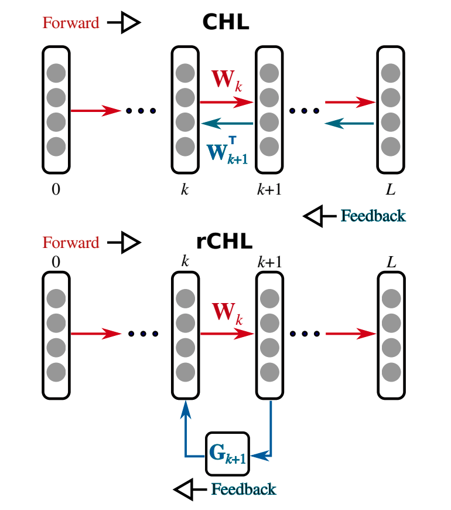
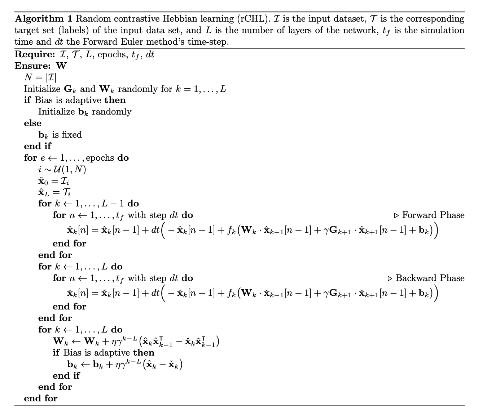

#Contrastive Hebbian Learning with Random Feedback Weights
[paper](https://arxiv.org/pdf/1806.07406.pdf)

## Abstruct
ニューラルネットワークは、学習アルゴリズムによって予測を行うように訓練されるのが一般的です。勾配バックプロパゲーションにヒントを得た強力なルールであるコントラスト・ヘブン・ラーニングは、ヘブのルールとコントラスト・ダイバージェンス・アルゴリズムに基づいています。

これは、データがネットワークに供給される前方（またはフリー）フェーズと、目標信号がネットワークの出力層にクランプされ、フィードバック信号がシナプスの重み行列の転置を通じて変換される後方（またはクランプ）フェーズの2つのフェーズで動作する。これはシナプスレベルでの対称性を意味するが、脳内ではその証拠はない。本研究では、ランダム対比ヘブ型学習と呼ばれるアルゴリズムの新しいバリエーションを提案します。このアルゴリズムは、シナプス重みの対称性に依存せず、ランダムな行列を用いてクランプ期のフィードバック信号を変換し、神経のダイナミクスを一次の非線形微分方程式で記述する。

このアルゴリズムは、ブーリアンロジックタスク、分類タスク（手書きの数字と文字）、オートエンコーディングタスクを解くことで、実験的に検証されています。また、パラメータが学習にどのような影響を与えるか、特にランダムマトリクスについて紹介します。疑似スペクトル分析を用いて、ランダム行列が学習プロセスにどのような影響を与えるかをさらに調査します。最後に、提案されたアルゴリズムの生物学的妥当性と、より優れた学習の計算モデルをどのように生み出すことができるかについて議論する。

## 1.IntroDuction

神経科学の研究では、げっ歯類や霊長類などの高度に複雑な生物の学習を支配するメカニズムや原理を理解するために、多大な努力が払われてきた。ヘブの学習[14]とスパイクタイミング依存性可塑性（STDP）[4, 28, 51]は，ヘブ則とSTDP則がともに神経系における適応の問題を解決し，シナプス可塑性を説明できることから，現代の計算論的神経科学に高い影響を与えている[2, 6]。一方，機械学習の分野では，深層ニューラルネットワークに勾配バックプロパゲーション（BP）[42, 8]を用いることで進歩を遂げ，さまざまな分類・表現タスクに最先端のソリューションを提供している[20]．しかし，このような進歩にもかかわらず，人工ニューラルネットワークで採用されているほとんどの学習アルゴリズムは，生物学的な観点からはありえないものであり，特にBPに基づく手法にその傾向が見られます．具体的には，(i) 重みが対称であること，(ii) ニューロンが時間的なダイナミクスを持たないこと（すなわち，ニューロンのダイナミクスは自律的に記述されない），などが挙げられる．ニューラルネットワークにおける情報の流れは、実際の生物学的システムとは異なる（前進、後退の異なるフェーズ間の同期が必要）、（v）後退フェーズでは前進フェーズの神経活動を保存する必要がある。前述のような背景から、機械学習アルゴリズムをより生物学的に妥当なものにする試みがなされている。

そのようなBPに代わる生物学的に妥当なアルゴリズムとして，ターゲットプロパゲーションアルゴリズムがある[21]。ターゲット伝搬アルゴリズムは，古典的なBPのようにエラー信号の代わりに伝搬されるターゲットに関する情報を用いて，ネットワークの各層で局所的なエラーを計算する。しかし、ターゲットプロパゲーションは、（局所的に）微分を計算し、シナプスレベルでの対称性を必要とする。生物学的に妥当な学習アルゴリズムとしては，再循環アルゴリズム[16]とその一般化であるGeneRec[38]がある．(ニューラルネットワークには、出力層から対称性のある重みを介して隠れた層にエラー信号を伝搬する再帰接続があります。

、GeneRecはエラー信号の導関数とバックプロパゲーションに基づいていますが、再循環アルゴリズムはシナプスレベルでの対称性を保持していません。さらに、前述のアルゴリズムはすべて、情報の流れの特定のパターンを必要とする。各層は、前の層が平衡状態に達するのを待ってから、入ってくる情報の受信と処理を進めなければならない。この問題は，Contrastive Hebbian Learning (CHL, deterministic Boltzmann Machine or a mean field approach) [31, 3, 50]によって回避することができますが，これはContrastive divergence algorithm [15]に似ています．CHLは，ヘブの学習則に基づいており，微分の知識を必要としません．さらに，その非線形連続結合ダイナミクスにより，情報が連続的に流れます．前後の層の収束を待たずに，すべての層のすべての神経活動が同時に更新される可能性がある．しかし、CHLは、フィードバック信号を後方に伝搬させるために、シナプスマトリックスの転置に依存しているため、シナプスの対称性が必要である。

さらに、GeneRecはエラー信号の導関数とバックプロパゲーションに基づいていますが、再循環アルゴリズムはシナプスレベルでの対称性を保持していません。さらに、前述のアルゴリズムはすべて、情報の流れの特定のパターンを必要とする。各層は、前の層が平衡状態に達するのを待ってから、入ってくる情報の受信と処理を進めなければならない。この問題は，Contrastive Hebbian Learning (CHL, deterministic Boltzmann Machine or a mean field approach) [31, 3, 50]によって回避することができますが，これはContrastive divergence algorithm [15]に似ています．CHLは，ヘブの学習則に基づいており，微分の知識を必要としません．さらに，その非線形連続結合ダイナミクスにより，情報が連続的に流れます．前後の層の収束を待たずに，すべての層のすべての神経活動が同時に更新される可能性がある．しかし、CHLは、フィードバック信号を後方に伝搬させるために、シナプスマトリックスの転置に依存しているため、シナプスの対称性が必要である。

我々は、より生物学的に妥当なCHLを作ることを動機として、ランダムコントラストヘブの学習（rCHL）を提案した。この学習では、対称性のあるシナプス重みを使用せず、代わりにCHLのシナプス重みの転置を固定のランダム行列に置き換える。これは、フィードバック・アライメント（FDA）[22, 35, 33]と同様の方法で行われた。CHLは、ニューロンレベルでの連続的な非線形ダイナミクスを採用しており、勾配に依存せず、情報が結合して同期的に流れることができ、ヘブの学習則に基づいているため、生物学的に現実的な学習則を開発するための良い基盤となる。CHLは，出力層から隠れ層への情報伝達にフィードバックを用いており，フィードバックゲインが小さい場合（クランプ期など）にはBPと同等の効果が得られることがXieとSeungによって実証されている[50]．この方法では，学習に必要な情報は，同じ軸索を介して伝達されるのではなく（対称的なケースでは必要），別々の経路や神経集団を介して伝達されますが，逆方向に伝播します。

したがって，我々が導入したランダム性は，視覚系で起こるように，他の大脳領域の構造やダイナミクスが，伝達された関心のある信号やフィードバック投影に干渉することを説明できるかもしれません[27, 25, 24, 43]．これは、必ずしも脳がランダムな変換を行うことを意味するのではなく、ここで転置シナプス行列の代わりに使用されているランダム行列は、より一般的な意味で、脳内の未知のまたはモデル化が困難なダイナミクスをモデル化するための道具と考えることができる。提案された学習スキームは、様々な文脈で使用することができ、いくつかの学習タスクで実証されている。具体的には、(i)XORなどの二項演算、(ii)手書きの数字や文字の分類、(iii)オートエンコーディングなどに、rCHLがどのように対応できるかを示す。これらのほとんどの場合、rCHLの性能（平均二乗誤差）は、BP、FDA、CHLと同等または類似しており、rCHLが一般的な生物学的に妥当な学習モデルの候補となりうることを示唆している。

## 2.Method
本節では、コントラスト・ヘブン・ラーニング(CHL)[50]を要約し、ランダム・コントラスト・ヘブン・ラーニング(rCHL)を紹介します。フィードフォワードネットワークとそれに対応するフィードバックを仮定します。Lは層の総数で，1が入力層，Lが出力層である．k - 1層からk層への接続は、行列Wk∈R m×nで与えられる。ここで、mとnはそれぞれk - 1層とk層のサイズ（ニューロン数）である。フィードバック接続はVk∈R n×mで与えられ，これは転置行列W|k（CHLの場合）か，ランダムCHLの場合はランダム行列Gk∈R n×mのいずれかである。CHL、rCHLともに、フィードバック接続には一定のゲインγ∈Rが掛けられている。

非線形性は、リプシッツ定数αk（すなわち、｜fk(x)-fk(y)｜≦αk｜x-y｜, ∀x, y∈R, k∈N）を持つ、リプシッツ連続関数fk : R n → R nと定義した。k番目の層のニューロンの状態は、状態関数x i k : R → Rで記述され、対応するバイアスはb i k∈Rで与えられる。

CHLと提案されたrCHLは、どちらも対照的な発散と同じ原理で動作します[15]。これは，学習が2つのフェーズで行われることを意味する．正（フリー）の段階では，入力が提示され，神経活動の前方伝播によって出力が構築される．負（クランプ）相では、出力はクランプされ、活動は入力層に向かって後方に伝搬する。自由相では，入力層x0は固定され，信号は各層を順に伝搬していく（図1の赤い矢印を参照）．各k番目の層のニューロンのダイナミクスは，k = 1, ... ... , L（L+1層）の場合，式（1）によって計算される．L+1層は存在しないため，xL+1 = 0，WL+1 = 0となる）．クランプフェーズでは，目標信号は出力層xLでクランプされ，各層のすべてのニューロンの活動は，k = 1, ... ... , L - 1について式（1）で計算される（ここで注意してほしいのは，xL+1 = 0，WL+1 = 0ということである）．各層のすべてのニューロンの活動は，k = 1, ... , L - 1について式（1）によって計算される（ここで，入力層k = 0はいかなるダイナミクスも表さないことに注意）．図1では、後ろ向きの流れがシアン色の矢印で示されています。2つのフェーズの最後に、我々は以下の式に基づいてシナプスの重みとバイアスを更新する、∆Wk = ηγk-L xˆk⊗ xˆk-1 - xˇk⊗ xˇk-1 , k = 1, . L, (2a) ∆bk = ηγk-L xˆk - xˇk (2b) ここで⊗はテンソル積、ηは学習率、γはフィードバックゲイン、∆Wkは重みの更新である。xˇkは自由相における式(1)の平衡配置でのk番目の層のニューロンの活動、xˆkはクランプ相におけるk番目の層の活動を表す。

式(1)で表されるように、CHLはフィードバック情報を利用するために、シナプスの重みが対称であること(W| k )を暗黙のうちに必要とする。この研究では、対称性を捨てて、CHLに現れるすべての転置行列をランダムな行列Gkに置き換えることが主な貢献である。

このアイデアは、学習中に一定であるランダムな行列を介してエラー信号が伝搬されるランダム・フィードバック・アライメント[22, 35]と似ている。したがって、式（1）は次のように修正される：dxk dt = -xk + fk Wk - xk-1 + γGk+1 - xk+1 + bk , (3) ここで、学習の増分は同じままである。

CHLとrCHLを適切に適用するために、Movellanが[31]で提案したトレーニングの第2の戦略（12ページ、ケース2）に従うと、まずクランプフェーズで活動を落ち着かせることを提案する。次に、活性度をリセットせずに、出力ユニットを解放し、活性度が再び落ち着くようにします。

この方法では、クランプフェーズの最小値に達したときに、それが安定していることを保証します。ここで，Iは入力データセット，Tは対応するターゲットセット，Nは入力サンプルの数，Lは層の数を表します．rCHLはシナプスの重みとフィードバックのランダム行列をランダムに初期化することから始まる。もしバイアスが学習することを許されていなければ、最初から固定されている。もしバイアスが適応することが許されているならば、それはランダムに初期化される。

そして，各エポックにおいて，rCHLは入力サンプルをランダムにピックアップし，それを入力層xˇ0に割り当てます．同時に、対応するラベル（ターゲット）を出力層xˆLに割り当てます。そして、各層の非線形連立微分方程式を、後ろ向きの段階ではオイラー法（Forward Euler）を用いてすべて解きます。つまり、xˆkを計算した後、xˇkを計算するために前進段階の非線形連立方程式系を再度解くのです。図1はニューラルネットワークのアーキテクチャとCHL(上段)とrCHL(下段)の情報の流れを示したものである。順方向のパスでは，入力が与えられ，情報が行列Wkを介して伝搬されます．後ろ向きの段階では，出力がクランプされ，情報は出力層から隠れた（複数の）層へと，転置行列W| k+1（CHL）またはランダム行列Gk+1（rCH

## 4.Discussion
私たちは、学習スキームのさまざまなパラメータが学習プロセスにどのように影響するかを検証し、アルゴリズムの徹底的な調査を行いました。我々は、フィードバックゲインγが学習のパフォーマンスに影響を与えることを示した。ゲインγが小さいほど、アルゴリズムの性能は向上し、フィードバックゲインは小さくすべきであることを示唆しています。これは、CHLがBPと同等であるためにはγの値を小さくする必要があるという、[50]で見られた以前の理論的な結果と一致している。

学習に影響を与える2つ目の要因は、隠れた層の数である。隠れた層の数が増えると、学習のパフォーマンスが低下する。しかし、これはフィードバックゲインγを増やすことで緩和することができる（図5参照）。最後に、ランダム行列Gの初期条件を検証した。その結果、ランダム行列を平均値ゼロの正規分布から選ぶと、Gを一様分布から描く場合に比べて、学習アルゴリズムの収束速度が速くなることがわかった。さらに、正規分布と一様分布のそれぞれの分散σと区間長λも、学習に影響を与えます。値が小さいほど、学習の収束が速くなります。さらに，擬似スペクトル解析[46, 49]で提供されているツールを用いて，フィードバック・ランダム・マトリクスを調査した．学習の収束は、フィードバック・ランダム・マトリクスを生成する分布の選択に影響されます。

現在の実装であるrCHLでは、後ろ向きの位相（クランプ）をトップダウンの信号伝搬と解釈することができます。例えば、文字などの視覚刺激が提示され、その文字の意味（どの文字が提示されているか）を学習する必要がある場合、ターゲットは意味であり、入力信号は文字の画像であると考えられます。したがって、順相は一次感覚野から高次連合野へのボトムアップ的な信号伝播を、逆相は高次認知野から低次連合野へのトップダウン的な信号伝播を模擬していると考えることができます。学習アルゴリズムと2つのフェーズ（正と負）の性質により、入力信号と目標信号はクランプされ、それらの信号のダイナミクスはネットワークの神経ダイナミクスに取り込まれ、埋め込まれます。

これは，BPの損失勾配を目標値に置き換えた目標伝搬法[21, 19]と比較することができる．目標値がフォワードパスの神経活性化に非常に近い場合、TPはBPのように振る舞います。この種の学習アルゴリズムは，局所的な情報を用いて，クレジット割り当て問題[30]を解決する．提案モデルでは、目標信号と入力信号の両方が神経活動のダイナミクスに組み込まれており、ヘブ則と反ヘブ則を通じて間接的に学習プロセスに影響を与える。本研究の主な貢献点は、対称的なフィードバックではなく、ランダムなフィードバックを用いてCHLを実装する新しい手法を開発したことである。これにより、研究対象となったほとんどのケースにおいて、性能と精度を損なうことなく、より生物学的に妥当なCHLの実装が可能となった。また、シナプス重みの転置行列を時間ステップごとに計算する必要がないため、実行時間を短縮することができる。

さらに、提案したアルゴリズムは、ニューロモーフィックデバイスの神経ダイナミクスをスパイキングニューロンに変換することができるため、ニューロモーフィックデバイスに適した学習スキームを提供します[10]。したがって、ニューロモーフィックなrCHLを実装するために、rCHLにおけるヘブのルールと同等のSTDP的な学習ルールを持つスパイキング・ニューラル・ネットワークを構築し、イベントベースのContrastive Divergence [32]やシナプス・サンプリング・マシン[34]のアイデアを利用することができる。このアイデアは、イベントベースのランダムバックプロパゲーションアルゴリズム[33]に類似しており、著者らは、ニューロモーフィックデバイス用にイベントベースのフィードバック整列に相当するものを実装しています。このモデルを拡張する可能性としては、計算を生物学的なケースに近づけるために、発火率ユニットをリーキー・インテグレート・アンド・ファイアー・ユニットのようなスパイキング・ニューロンに置き換えることが考えられます。もう1つの可能性は、ニューラルダイナミクスの統合における同期を完全に取り除くことです。これは，神経ダイナミクスの統合が，よりイベントベースの方法でオンデマンドで行われることを意味します [41, 44]．ユニットは互いに結合しており、活動の伝播はより自然な方法で行われるので、rCHLの実装に非同期アルゴリズムを使用して、より効率的かつ自然な方法でスケールアップできるかもしれません。また、将来的には、学習ルールにスパース性の制約を加えることで、データのエンコード処理をより効率的に行うことができるようになるでしょう。さらに，このような修正を行うことで，海馬で発生する疎な圧縮など，より多くの生物学的現象をシミュレートできるようになります[39]．

今後は、与えられた問題に最適なランダム行列Gの種類や、そのような行列が存在する場合の設計方法について、さらに分析を進めていきたいと考えています。つまり、最適なランダム行列Gが存在するのであれば、解きたい問題に応じて、その行列を生成する固有値（または特異値）と分布を適切に選択することができます。そのためには、シュードスペクトラ解析が重要な役割を果たします。疑似スペクトルは、特異値、学習の収束、精度の関係をよりよく理解するのに役立ちます。これにより、特定の特性を持つフィードバックマトリクスを設計するための洗練された手法を開発することができます。したがって、学習プロセスを改善し、加速することができるでしょう。

